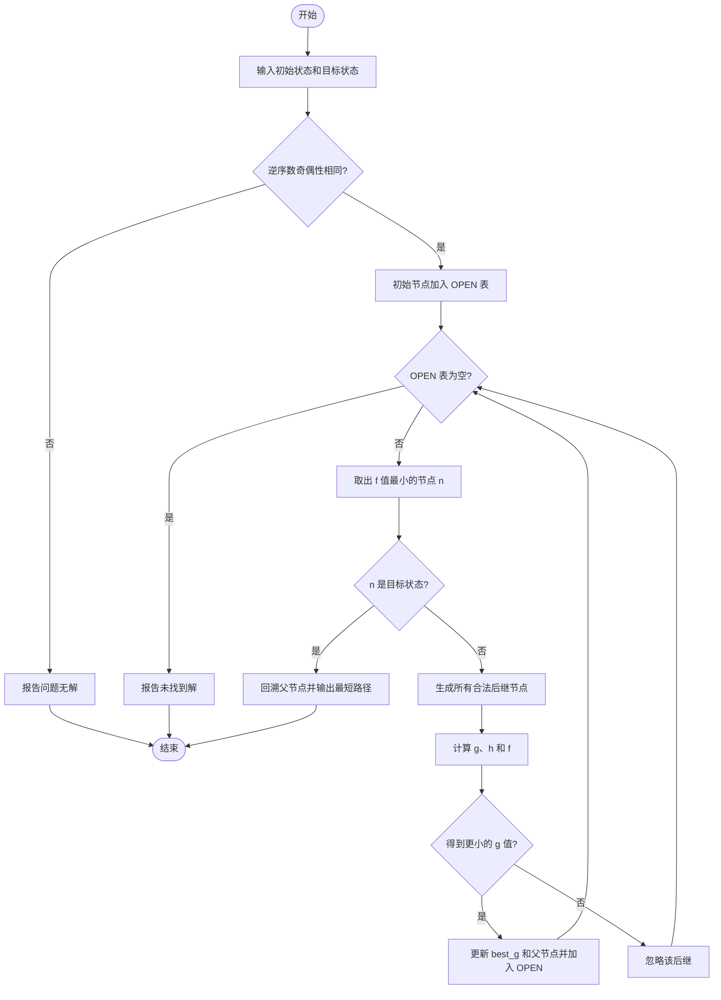
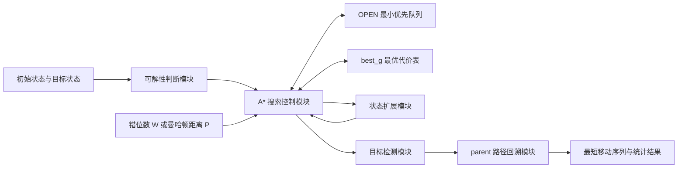

## 一、实验目的

1. 理解启发式搜索的基本思想，掌握 A* 搜索中 `OPEN` 表、`CLOSED` 表和估价函数的作用。
2. 掌握八数码问题的状态表示、状态扩展、目标检测和解路径回溯方法。
3. 使用 Python 实现 A* 算法，求出从给定初始状态到目标状态的最短移动序列。
4. 比较不同启发函数对搜索速度、扩展节点数和空间开销的影响。
5. 根据实验结果总结启发式搜索的特点、优点及局限性。

## 二、实验环境

| 项目   | 配置                                          |
| ---- | ------------------------------------------- |
| 操作系统 | Windows 10/11                               |
| 编程语言 | Python 3.10 及以上版本                           |
| 开发环境 | Anaconda3 5.0 及以上版本，或任意支持 Python 3 的 IDE/终端 |
| 标准库  | `heapq`、`dataclasses`、`itertools`、`time`    |
| 程序文件 | `eight_puzzle_astar.py`                     |

运行命令：

```bash
python eight_puzzle_astar.py
```

## 三、问题描述

八数码问题由一个 `3 x 3` 棋盘组成，其中放置数字 1～8 和一个空格。每次只能将空格与其上、下、左、右相邻的数字交换。实验要求从初始状态出发，通过一系列合法移动到达目标状态。

### 3.1 初始状态与目标状态

初始状态：

```text
2 8 3
1 6 4
7 _ 5
```

目标状态：

```text
1 2 3
8 _ 4
7 6 5
```

其中 `_` 表示空格，在程序中使用数字 `0` 表示。

### 3.2 状态表示

程序使用长度为 9 的元组按行保存棋盘。例如初始状态表示为：

```python
(2, 8, 3, 1, 6, 4, 7, 0, 5)
```

元组不可变，适合作为字典的键，用于记录某个状态的最小实际代价和父状态。

### 3.3 状态空间

- **状态**：棋盘上 8 个数字和一个空格的一种排列。
- **初始节点**：题目给定的初始状态。
- **目标节点**：题目给定的目标状态。
- **算符**：空格上移、下移、左移、右移。
- **路径代价**：每移动一次代价为 1，因此路径代价等于移动次数。

## 四、基本原理

### 4.1 A* 估价函数

A* 算法按照下面的估价函数选择最有希望的节点：

$$
f(n)=g(n)+h(n)
$$

- `g(n)`：从初始状态到当前状态 `n` 的实际移动次数。
- `h(n)`：从当前状态到目标状态所需代价的估计值。
- `f(n)`：经过当前状态到达目标状态的总代价估计值。

每次从 `OPEN` 表中取出 `f(n)` 最小的节点进行扩展。程序使用最小堆实现优先队列，从而高效地取得最小值。

### 4.2 两种启发函数

#### 1. 错位数 `W(n)`

统计不在目标位置上的数字块数量，不计算空格：

$$
W(n)=\sum_{i=1}^{8} [position_n(i) \ne position_goal(i)]
$$

每个错位数字至少需要移动一次，因此 `W(n)` 不会高估实际剩余代价，是可采纳启发函数。

#### 2. 曼哈顿距离 `P(n)`

计算每个数字当前位置与目标位置之间的横向距离和纵向距离，再对 8 个数字求和：

$$
P(n)=\sum_{i=1}^{8}(|x_i-x_i^*|+|y_i-y_i^*|)
$$

一次移动最多使一个数字向目标位置靠近一格，所以曼哈顿距离同样不会高估真实剩余代价。一般情况下，`P(n)` 比 `W(n)` 包含更多位置信息，指导能力更强。

### 4.3 可解性判断

并不是任意初始状态都能到达任意目标状态。对于 `3 x 3` 棋盘，忽略空格后，如果初始状态和目标状态的逆序数奇偶性相同，则二者相互可达；否则无解。程序在搜索前进行这一判断，避免在无解状态空间中进行无效搜索。

## 五、解决问题的主要思路

1. 用元组表示一个棋盘状态，用 `0` 表示空格。
2. 搜索前比较初始状态和目标状态的逆序数奇偶性。
3. 找到空格位置，尝试四个方向的合法移动，生成后继状态。
4. 用最小堆维护 `OPEN` 表，优先扩展 `f(n)=g(n)+h(n)` 最小的状态。
5. 使用 `best_g` 保存每个状态目前已知的最小 `g` 值，避免重复扩展更差路径。
6. 使用 `parent` 保存父状态和移动方向，到达目标后反向回溯得到完整解路径。
7. 分别使用 `W(n)` 和 `P(n)` 运行程序，比较搜索性能。

## 六、算法流程图



## 七、算法框图与伪代码



各模块分工明确：状态扩展模块负责产生合法棋盘，启发函数负责估计剩余代价，优先队列决定搜索顺序，`best_g` 负责剪除较差的重复路径，父节点表负责还原最终答案。

```text
A_STAR(start, goal, h):
    若 start 与 goal 的逆序数奇偶性不同:
        返回“无解”

    OPEN <- 只含 start 的最小优先队列
    best_g[start] <- 0
    parent[start] <- 空

    当 OPEN 不为空时:
        n <- 取出 f(n) 最小的节点

        若 n 是 goal:
            根据 parent 回溯并返回路径

        对 n 的每个合法后继 s:
            new_g <- g(n) + 1
            若 s 从未访问，或 new_g < best_g[s]:
                best_g[s] <- new_g
                parent[s] <- n
                f(s) <- new_g + h(s)
                将 s 加入 OPEN

    返回“未找到解”
```

## 八、实验步骤

1. 确定初始状态和目标状态，并用一维元组表示。
2. 编写 `inversions()` 和 `is_solvable()`，完成可解性检查。
3. 编写 `neighbors()`，根据空格位置生成所有合法后继状态。
4. 编写错位数启发函数 `misplaced_tiles()`。
5. 编写曼哈顿距离启发函数 `manhattan_distance()`。
6. 编写 A* 主循环，并使用最小堆维护待扩展节点。
7. 保存父状态和对应移动方向，以便得到完整路径。
8. 分别用两种启发函数运行程序，记录移动步数、扩展节点数、生成节点数和 `OPEN` 表最大长度。
9. 检查最终状态是否与目标状态一致，并对两组结果进行分析。

## 九、实验结果展示

### 9.1 性能对比

| 启发函数         | 最短步数 | 扩展节点数 | 生成节点数 | OPEN 最大长度 |
| ------------ | ---: | ----: | ----: | --------: |
| `W(n)` 错位数   |    5 |     7 |    14 |         8 |
| `P(n)` 曼哈顿距离 |    5 |     6 |    12 |         7 |

运行时间通常小于 1 ms，会受到计算机性能和当前负载影响，因此表中重点比较与环境无关的节点数量。

两种启发函数都得到 5 步最短解，说明二者在本题中都能保证最优性。曼哈顿距离少扩展 1 个节点、少生成 2 个节点，并且优先队列峰值更小。

### 9.2 最短移动序列

#### Step 0：初始状态

```text
2 8 3
1 6 4
7 _ 5
```

#### Step 1：空格上移

```text
2 8 3
1 _ 4
7 6 5
```

#### Step 2：空格上移

```text
2 _ 3
1 8 4
7 6 5
```

#### Step 3：空格左移

```text
_ 2 3
1 8 4
7 6 5
```

#### Step 4：空格下移

```text
1 2 3
_ 8 4
7 6 5
```

#### Step 5：空格右移，到达目标状态

```text
1 2 3
8 _ 4
7 6 5
```

最终移动序列为：

```text
上移 -> 上移 -> 左移 -> 下移 -> 右移
```

## 十、估价函数对搜索速度的影响

### 10.1 启发值过小

当 `h(n)=0` 时，A* 退化为一致代价搜索。算法仍能找到最短解，但几乎没有目标方向的信息，通常需要扩展大量节点。

### 10.2 启发值更接近真实代价

在不超过真实剩余代价的前提下，`h(n)` 越接近真实代价，算法越容易把搜索集中到接近目标的区域。对任意八数码状态都有：

$$
P(n) \ge W(n)
$$

曼哈顿距离不仅判断数字是否错位，还反映它距离目标位置有多远，因此通常比错位数更有信息。本次实验的节点统计也验证了这一点。

### 10.3 启发值过大

如果人为放大 `h(n)`，搜索可能更快地朝目标方向前进，但启发函数可能高估真实代价。此时 A* 不再保证得到最短路径，算法会在搜索速度和解的最优性之间进行取舍。

### 10.4 结论

合适的估价函数应同时满足两个条件：计算开销不能太大，并且尽量接近真实剩余代价。曼哈顿距离在八数码问题中计算简单、信息量较高，是比错位数更合适的启发函数。

## 十一、启发式搜索的特点

1. **具有方向性**：利用问题相关知识估计目标方向，减少盲目搜索。
2. **效率依赖启发函数**：启发函数越准确，通常扩展的无关节点越少。
3. **可保证最优性**：当 `h(n)` 可采纳且满足一致性时，A* 能得到代价最小的解。
4. **仍可能占用较多内存**：A* 需要保存大量待扩展节点和已访问状态，状态空间很大时内存压力明显。
5. **启发函数需要领域知识**：不同问题需要设计不同的估计方法，设计质量会直接影响性能。
6. **需要处理重复状态**：若不记录状态的最优 `g` 值，同一棋盘可能被重复生成，降低效率。

## 十二、实验结论

本实验使用 A* 算法成功求解了八数码问题，并得到长度为 5 的最短移动序列。错位数和曼哈顿距离都能保证本题解的最优性，但曼哈顿距离提供了更精确的目标位置信息，因此扩展节点数、生成节点数和队列峰值均更小。实验说明：启发式搜索的核心不是简单增大启发值，而是在保证估计合理的前提下提高估价函数的信息量。

## 附件：关键程序代码

### A* 搜索核心

```python
def astar(start, goal, heuristic):
    if not is_solvable(start, goal):
        raise ValueError("The start state cannot reach the goal state.")

    counter = itertools.count()
    open_heap = []
    best_g = {start: 0}
    parent = {start: (None, "初始状态")}
    h0 = heuristic(start, goal)
    heapq.heappush(open_heap, PrioritizedNode(h0, next(counter), start, 0, h0))

    while open_heap:
        current = heapq.heappop(open_heap)
        if current.g != best_g[current.state]:
            continue
        if current.state == goal:
            return reconstruct_path(parent, goal)

        for next_state, move in neighbors(current.state):
            new_g = current.g + 1
            if new_g >= best_g.get(next_state, 10**9):
                continue
            best_g[next_state] = new_g
            parent[next_state] = (current.state, move)
            h = heuristic(next_state, goal)
            heapq.heappush(
                open_heap,
                PrioritizedNode(new_g + h, next(counter), next_state, new_g, h),
            )
```

### 启发函数

```python
def misplaced_tiles(state, goal):
    return sum(
        1 for i, tile in enumerate(state)
        if tile != 0 and tile != goal[i]
    )


def manhattan_distance(state, goal):
    goal_pos = {tile: divmod(i, 3) for i, tile in enumerate(goal)}
    total = 0
    for i, tile in enumerate(state):
        if tile == 0:
            continue
        r1, c1 = divmod(i, 3)
        r2, c2 = goal_pos[tile]
        total += abs(r1 - r2) + abs(c1 - c2)
    return total
```

完整源程序见同目录下的 `eight_puzzle_astar.py`。
