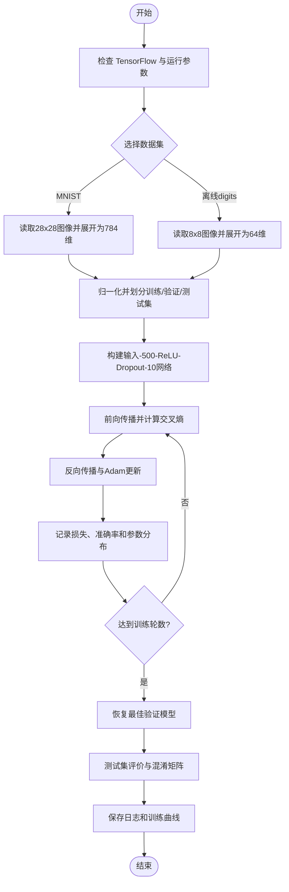
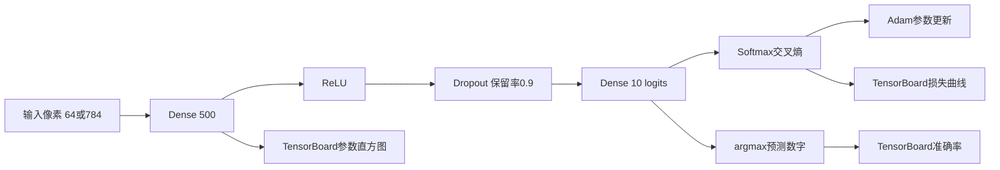

# 人工智能实验报告

## 实验七：用 TensorFlow 做手写数字识别

| 项目 | 内容 |
| --- | --- |
| 实验题目 | 使用 TensorFlow 建立神经网络并识别手写数字 |
| 学号 | 请填写 |
| 班级 | 请填写 |
| 姓名 | 请填写 |
| 完成日期 | 请填写 |

---

## 一、实验内容

本实验建立一个最简单的全连接神经网络，用手写数字数据训练 0～9 十分类模型，并记录损失、准确率和参数分布等训练信息。主实现采用现代 TensorFlow 2/Keras API，并通过 TensorBoard 回调保存事件日志。

为了保证程序在当前离线环境中可以真实运行，代码还提供结构等价的 PyTorch 回退后端。当 TensorFlow 未安装时，`--backend auto` 会自动选择 PyTorch，保存训练历史 CSV 和训练曲线；安装 TensorFlow 后无需改代码即可使用 TensorFlow 和 TensorBoard。

## 二、实验目的

1. 掌握使用 TensorFlow 创建神经网络的方法。
2. 理解输入层、隐藏层、ReLU、dropout 和输出层的作用。
3. 掌握手写数字数据的归一化、向量化及数据集划分方法。
4. 理解 softmax 交叉熵、Adam 优化器和准确率指标。
5. 掌握使用 TensorBoard 观察损失、准确率、参数直方图和计算图的方法。
6. 理解 TensorFlow 1 旧式计算图代码与 TensorFlow 2/Keras 代码的对应关系。

## 三、实验环境

### 3.1 附件参考环境

| 软件 | 版本 |
| --- | --- |
| Python | 3.6.5 |
| NumPy | 1.14.5 |
| Matplotlib | 2.2.2 |
| scikit-learn | 0.19.1 |
| TensorFlow | 文档使用 TensorFlow 1 风格 API |

### 3.2 本机实际环境

| 软件 | 状态/版本 |
| --- | --- |
| Python | 3.11.4 |
| NumPy | 2.4.6 |
| scikit-learn | 1.8.0 |
| PyTorch | 2.11.0，实际验证后端 |
| TensorFlow/TensorBoard | 当前环境未安装 |
| 程序文件 | `tensorflow_handwriting.py` |

## 四、运行方法

### 4.1 当前离线环境

```bash
python tensorflow_handwriting.py
```

程序自动使用 PyTorch 等价网络和 sklearn 内置 digits 数据集，不访问网络。

### 4.2 使用 TensorFlow 2 与 TensorBoard

安装 TensorFlow 后运行：

```bash
python tensorflow_handwriting.py --backend tensorflow --dataset digits
tensorboard --logdir ./MNIST_LOG --port 8008
```

浏览器访问 `http://localhost:8008`，即可查看 TensorBoard。

若本机可以下载或已经缓存 MNIST，可改用附件要求的 28×28 数据：

```bash
python tensorflow_handwriting.py --backend tensorflow --dataset mnist
```

## 五、MNIST 数据集

MNIST 包含 60,000 幅训练图像和 10,000 幅测试图像，每幅图像为 28×28 灰度图，对应一个 0～9 标签。输入全连接网络前，将图像展开为长度 784 的向量，并把像素缩放到 `[0,1]`。

本机没有缓存 MNIST 且当前环境不使用网络下载，因此实际验证使用 sklearn 内置 digits 数据集。它有 1797 幅 8×8 灰度图，算法流程与 MNIST 相同，只是输入维度由 784 变为 64。

实际数据划分如下：

| 数据部分 | 样本数 | 用途 |
| --- | ---: | --- |
| 训练集 | 1221 | 更新权重和偏置 |
| 验证集 | 216 | 选择最佳训练轮次 |
| 测试集 | 360 | 最终性能评价 |

## 六、神经网络原理

### 6.1 全连接层

全连接层执行线性变换：

$$
z=Wx+b
$$

其中 $x$ 是输入向量，$W$ 是权重矩阵，$b$ 是偏置。第一层把输入映射到 500 个隐藏神经元。

### 6.2 ReLU 激活函数

隐藏层使用 ReLU：

$$
ReLU(z)=\max(0,z)
$$

ReLU 引入非线性，使网络能够学习比线性分类器更复杂的决策边界。

### 6.3 Dropout

训练时随机保留 90% 的隐藏神经元，即：

$$
keep\_probability=0.9,\quad dropout\_rate=0.1
$$

随机关闭部分神经元可以降低共同适应，缓解过拟合。验证和测试时使用全部神经元。

### 6.4 Softmax 与交叉熵

输出层产生 10 个 logits。softmax 将它们转换为类别概率：

$$
P(y=c\mid x)=\frac{e^{z_c}}{\sum_{j=0}^{9}e^{z_j}}
$$

多分类交叉熵为：

$$
L=-\frac{1}{N}\sum_{i=1}^{N}\log P(y_i\mid x_i)
$$

训练通过 Adam 优化器最小化交叉熵，学习率为 `0.001`。

### 6.5 准确率

预测类别是 logits 最大值的下标：

$$
\hat{y}=\arg\max_c z_c
$$

准确率是预测正确的样本数占总样本数的比例。

## 七、模型结构

### 7.1 附件要求的 MNIST 结构

```text
输入层 784 -> 隐藏层 500 + ReLU -> Dropout(保留率 0.9) -> 输出层 10
```

### 7.2 程序的动态输入结构

| 层 | MNIST 模式 | 离线 digits 模式 | 激活/设置 |
| --- | ---: | ---: | --- |
| 输入 | 784 | 64 | 归一化像素 |
| 隐藏层 | 500 | 500 | ReLU |
| Dropout | 500 | 500 | 保留率 0.9 |
| 输出层 | 10 | 10 | logits |

除输入维度外，两种数据模式使用完全相同的网络思想。

## 八、TensorBoard 原理与记录内容

TensorBoard 读取训练过程中产生的事件文件，并在 Web 页面展示：

- `Scalars`：训练损失、验证准确率和学习率。
- `Images`：输入的手写数字图像。
- `Graphs`：模型计算图和层之间的连接。
- `Histograms`：权重、偏置和激活值分布。
- `Distributions`：参数分布随训练轮次的变化。
- `Embeddings`：高维嵌入投影，本实验未专门构建。
- `Audio`：音频数据，本实验不涉及。

TensorFlow 主后端通过以下回调写入日志：

```python
tf.keras.callbacks.TensorBoard(
    log_dir=str(log_dir),
    histogram_freq=1,
    write_graph=True,
    write_images=True,
)
```

附件中的 `tf.summary.FileWriter`、占位符和会话属于 TensorFlow 1 API。现代 TensorFlow 2 默认即时执行，使用 `model.fit()` 与 `TensorBoard` 回调即可完成相同目标。

## 九、解决问题的主要思路

1. 检查 TensorFlow 是否安装，并根据 `--backend` 选择后端。
2. 加载 digits 或 MNIST，将图像展平并归一化。
3. 按类别比例划分训练集、验证集和测试集。
4. 构建“输入层－500 隐藏单元－dropout－10 输出单元”的网络。
5. 使用 Adam 和交叉熵训练模型，每轮计算验证准确率。
6. 保存验证准确率最高的模型参数。
7. 在独立测试集上计算准确率和混淆矩阵。
8. 保存训练历史；TensorFlow 后端同时生成 TensorBoard 事件文件。
9. 绘制训练损失和验证准确率曲线，检查收敛过程。

## 十、算法流程图



## 十一、模型框图



## 十二、算法伪代码

```text
加载并归一化手写数字数据
划分训练集、验证集和测试集
初始化 Dense(input_dim, 500) 和 Dense(500, 10)

对每个 epoch:
    对每个训练 batch:
        hidden <- ReLU(xW1 + b1)
        hidden <- Dropout(hidden, keep_probability=0.9)
        logits <- hiddenW2 + b2
        loss <- SoftmaxCrossEntropy(logits, label)
        反向传播并使用 Adam 更新参数

    计算验证准确率
    记录 loss、accuracy 和参数分布
    若验证准确率提高，保存模型参数

恢复最佳模型
计算测试准确率和混淆矩阵
保存训练日志与曲线
```

## 十三、实验步骤

1. 编写数据加载函数，将像素归一化并按类别分层划分。
2. 编写 TensorFlow 2 模型：隐藏层 500、ReLU、dropout、输出层 10。
3. 设置学习率 `0.001`、保留率 `0.9`、批大小 `100`。
4. 添加 TensorBoard 回调，记录计算图、标量和参数直方图。
5. 编写 PyTorch 等价回退网络，保证无 TensorFlow 时仍可验证算法。
6. 训练 25 轮，保存每轮训练损失和验证准确率。
7. 恢复最佳验证轮次，在 360 个测试样本上计算指标。
8. 输出混淆矩阵，并生成 `training_curve.png`。
9. 检查曲线是否表现为损失下降、准确率上升。

## 十四、实验结果

### 14.1 本机实际结果

```text
backend=torch; dataset=sklearn digits 8x8 (offline)
train=1221, validation=216, test=360, features=64
hidden=500, learning_rate=0.001, keep_probability=0.9, epochs=25

best_epoch=22
best_validation_accuracy=97.2222%
test_accuracy=96.3889%
```

训练曲线：


从图中可以看到，训练损失从 `2.1453` 持续下降到 `0.0848`；验证准确率由 `80.0926%` 提升，在第 22 轮达到最高 `97.2222%`。之后验证准确率有小幅波动，因此最终评价使用第 22 轮的模型。

### 14.2 测试错误分析

测试集共有 360 个样本，正确识别 347 个，错误 13 个，准确率为 `96.3889%`。主要混淆包括：

| 真实数字 | 预测数字 | 数量 |
| ---: | ---: | ---: |
| 1 | 4、6、8、9 | 各 1、1、1、2 |
| 3 | 5 | 1 |
| 6 | 8 | 1 |
| 8 | 1 | 4 |
| 9 | 8 | 1 |
| 0 | 4 | 1 |

数字 8 与 1 的混淆最明显。原因是 `8 x 8` 图像分辨率较低，数字 8 的闭环可能断裂，展平后的全连接网络又没有显式利用二维局部结构。

### 14.3 与附件结果的关系

附件在 MNIST 上训练 1000 步，准确率从约 `10.48%` 提高到约 `96.76%`。本机离线实验使用不同数据集和训练轮次，测试准确率为 `96.3889%`，二者不能直接作严格横向比较，但都表现出损失下降、准确率随训练提高的趋势。

## 十五、结果分析

1. 500 个隐藏神经元使网络能够学习非线性数字特征，性能明显优于随机猜测的 10%。
2. dropout 在训练时引入随机性，因此验证准确率不会逐轮严格增加，但整体趋势上升。
3. 训练损失继续下降而验证准确率出现波动，说明后期已经出现轻微过拟合迹象，恢复最佳模型是合理的。
4. 全连接网络忽略图像局部空间关系，因此对位移、断笔和形变较敏感；卷积神经网络通常更适合图像任务。
5. TensorBoard 能同时查看损失、准确率、计算图和参数分布，比只观察终端输出更容易发现收敛异常和过拟合。

## 十六、实验结论

本实验完成了手写数字全连接神经网络、交叉熵损失、Adam 优化、dropout 和训练可视化流程。程序以 TensorFlow 2 为主实现，并兼容 TensorBoard；在本机缺少 TensorFlow 的情况下，等价 PyTorch 后端仍完成了真实训练，测试准确率达到 `96.3889%`。实验说明简单神经网络可以有效识别手写数字，而训练曲线和参数日志是判断模型是否收敛、是否过拟合的重要依据。

## 附件：关键程序代码

```python
model = tf.keras.Sequential([
    tf.keras.layers.Input(shape=(train_x.shape[1],), name="input"),
    tf.keras.layers.Dense(500, activation="relu", name="layer1"),
    tf.keras.layers.Dropout(1.0 - keep_probability, name="dropout"),
    tf.keras.layers.Dense(10, name="layer2"),
])

model.compile(
    optimizer=tf.keras.optimizers.Adam(learning_rate=0.001),
    loss=tf.keras.losses.SparseCategoricalCrossentropy(from_logits=True),
    metrics=["accuracy"],
)

tensorboard_callback = tf.keras.callbacks.TensorBoard(
    log_dir=str(log_dir),
    histogram_freq=1,
    write_graph=True,
    write_images=True,
)
```

完整源程序见同目录下的 `tensorflow_handwriting.py`，实际训练历史位于 `MNIST_LOG/training_history.csv`。

## 参考文献

1. Ian Goodfellow, Yoshua Bengio, Aaron Courville. *Deep Learning*. MIT Press, 2016.
2. 郑泽宇, 梁博文, 顾思宇. 《TensorFlow：实战 Google 深度学习框架》. 电子工业出版社, 2018.
