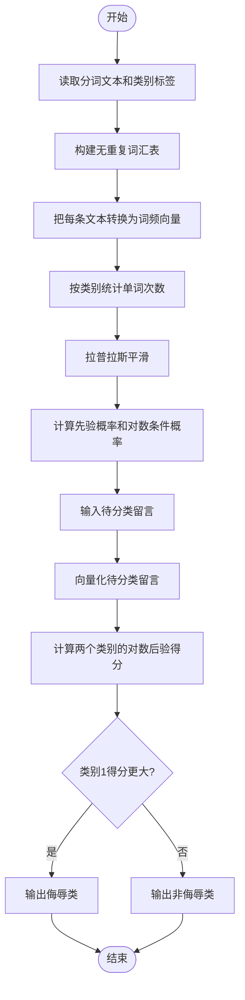

# 人工智能实验报告

## 实验三：朴素贝叶斯算法

| 项目 | 内容 |
| --- | --- |
| 实验题目 | 朴素贝叶斯算法原理及文本分类实践 |
| 学号 | 请填写 |
| 班级 | 请填写 |
| 姓名 | 请填写 |
| 完成日期 | 请填写 |

---

## 一、实验内容

本实验学习贝叶斯决策、条件概率、全概率公式和朴素贝叶斯分类原理，并使用 Python 实现一个社区留言过滤器。程序将留言分为“非侮辱类”和“侮辱类”，完成数据加载、词汇表构建、文本向量化、模型训练和新文本分类的完整流程。

## 二、实验目的

1. 掌握条件概率、贝叶斯公式和朴素贝叶斯算法的基本原理。
2. 理解先验概率、条件概率和后验概率在分类问题中的含义。
3. 掌握文本的词汇表表示及向量化方法。
4. 使用 Python 独立实现朴素贝叶斯文本分类器。
5. 理解条件独立假设、拉普拉斯平滑和对数概率的作用。

## 三、实验环境与预备知识

| 项目   | 内容                   |
| ---- | -------------------- |
| 操作系统 | Windows 10/11        |
| 编程语言 | Python 3.6.5 及以上版本   |
| 依赖库  | NumPy                |
| 程序文件 | `naive_bayes.py`     |
| 预备知识 | 概率论与数理统计、Python 编程基础 |

运行命令：

```bash
python naive_bayes.py
```

## 四、实验原理

### 4.1 贝叶斯决策理论

对于具有多个类别的分类问题，将样本判定为后验概率最大的类别：

$$
\hat{c}=\arg\max_c P(c\mid x)
$$

如果一个样本属于类别 1 的概率大于属于类别 2 的概率，就把它判为类别 1。贝叶斯分类的核心就是“选择后验概率最大的类别”。

### 4.2 条件概率

在事件 $B$ 已发生的条件下，事件 $A$ 发生的概率为：

$$
P(A\mid B)=\frac{P(A\cap B)}{P(B)}
$$

由联合概率的对称性 $P(A\cap B)=P(B\cap A)$ 可得：

$$
P(A\mid B)P(B)=P(B\mid A)P(A)
$$

### 4.3 全概率公式

若事件 $A_1,A_2,\ldots,A_n$ 构成样本空间的一个完备划分，则：

$$
P(B)=\sum_{i=1}^{n}P(B\mid A_i)P(A_i)
$$

全概率公式把复杂事件的概率分解为多个互斥情况的概率之和。

### 4.4 贝叶斯公式

由条件概率可以得到：

$$
P(A\mid B)=\frac{P(B\mid A)P(A)}{P(B)}
$$

- $P(A)$ 是先验概率，表示观察证据前对类别的认识。
- $P(B\mid A)$ 是似然，表示类别为 $A$ 时观察到证据 $B$ 的可能性。
- $P(A\mid B)$ 是后验概率，表示观察证据后对类别概率的修正。

分类时所有类别的分母 $P(B)$ 相同，因此只需比较分子 $P(B\mid A)P(A)$，不必单独计算全概率。

### 4.5 朴素贝叶斯

设文本 $d$ 由特征 $w_1,w_2,\ldots,w_m$ 表示。朴素贝叶斯假设：给定类别 $c$ 后，各个特征条件独立。因此：

$$
P(d\mid c)=\prod_{i=1}^{m}P(w_i\mid c)
$$

分类规则为：

$$
\hat{c}=\arg\max_c P(c)\prod_{i=1}^{m}P(w_i\mid c)
$$

该假设在自然语言中并不完全成立，因为词语之间通常存在联系，但它显著降低了概率估计难度，在小型文本分类任务中仍能取得良好效果。

### 4.6 拉普拉斯平滑

如果某个词从未在某一类别中出现，则直接估计得到的条件概率为 0，所有概率的乘积也会变为 0。程序采用加一平滑：

$$
P(w_i\mid c)=\frac{N_{ic}+1}{N_c+|V|}
$$

其中 $N_{ic}$ 是词 $w_i$ 在类别 $c$ 中的出现次数，$N_c$ 是该类别的总词数，$|V|$ 是词汇表大小。

### 4.7 对数概率

许多小概率连续相乘可能造成浮点数下溢。利用对数把乘法转换为加法：

$$
\log P(c\mid d) \propto \log P(c)+\sum_i N_i(d)\log P(w_i\mid c)
$$

对数函数单调递增，因此比较对数得分不会改变分类结果。

## 五、实验数据

| 编号 | 分词后的留言 | 标签 | 类别 |
| ---: | --- | ---: | --- |
| 1 | `my dog has flea problems help please` | 0 | 非侮辱类 |
| 2 | `maybe not take him to dog park stupid` | 1 | 侮辱类 |
| 3 | `my dalmation is so cute i love him` | 0 | 非侮辱类 |
| 4 | `stop posting stupid worthless garbage` | 1 | 侮辱类 |
| 5 | `mr licks ate my steak how to stop him` | 0 | 非侮辱类 |
| 6 | `quit buying worthless dog food stupid` | 1 | 侮辱类 |

标签 `1` 表示侮辱类，标签 `0` 表示非侮辱类。两类各有 3 条留言，所以先验概率为：

$$
P(c=1)=P(c=0)=0.5
$$

## 六、解决问题的主要思路

1. 读取已经完成分词和标注的 6 条训练留言。
2. 对所有训练文本中的单词求并集，排序后形成稳定的词汇表。
3. 将每条留言转换为与词汇表等长的词频向量。
4. 按类别累计各单词的出现次数，并使用拉普拉斯平滑计算条件概率。
5. 将条件概率转换为对数，避免多个小概率相乘造成下溢。
6. 对新留言分别计算类别 0 和类别 1 的对数后验得分。
7. 选择得分较大的类别作为预测结果，并在训练集上检查程序正确性。

## 七、算法流程图



## 八、算法框图


## 九、算法伪代码

```text
TRAIN(documents, labels):
    vocabulary <- 所有训练文档单词的并集
    matrix <- 将每篇文档转换为词频向量
    对类别 0 和类别 1 的单词计数全部初始化为 1
    对两个类别的总词数初始化为 |vocabulary|

    对每篇训练文档:
        按它的类别累加词频和总词数

    计算 P(c=1)
    计算 log P(word | c=0) 和 log P(word | c=1)
    返回模型

CLASSIFY(document, model):
    vector <- 使用训练词汇表向量化 document
    score0 <- log P(c=0) + vector · log P(word | c=0)
    score1 <- log P(c=1) + vector · log P(word | c=1)
    返回得分较大的类别
```

## 十、实验步骤

1. 编写 `load_dataset()`，建立实验文本和标签。
2. 编写 `create_vocabulary()`，构造不重复且顺序固定的词汇表。
3. 编写 `set_of_words_vector()`，实现附件要求的 0/1 词集模型。
4. 编写 `bag_of_words_vector()`，保存词频并作为实际训练表示。
5. 编写 `train_naive_bayes()`，统计先验概率和条件概率。
6. 在训练中使用拉普拉斯平滑，并保存条件概率的自然对数。
7. 编写 `classify()`，比较两个类别的对数后验得分。
8. 使用三条新留言测试模型，并计算训练集准确率。
9. 核对侮辱词较多的测试文本是否被判为侮辱类。

## 十一、实验结果

程序运行得到：

```text
朴素贝叶斯社区留言分类实验
训练文档数: 6
词汇表大小: 32
侮辱类先验概率 P(c=1): 0.500
训练集准确率: 100.00%
训练矩阵形状: (6, 32)

测试结果:
['love', 'my', 'dalmation'] -> 非侮辱类 (0)
['stupid', 'garbage'] -> 侮辱类 (1)
['help', 'please'] -> 非侮辱类 (0)
```

| 测试文本 | 预测类别 | 分析 |
| --- | --- | --- |
| `love my dalmation` | 非侮辱类 | `love`、`dalmation` 只在正常留言中出现 |
| `stupid garbage` | 侮辱类 | 两个词都具有明显的侮辱类倾向 |
| `help please` | 非侮辱类 | 两个词出现在正常求助留言中 |

实际输出还包含两个类别的对数得分。得分只用于比较大小，不是直接的概率；如果需要规范化概率，可以再使用 softmax 进行转换。

## 十二、结果分析

1. 训练集上 6 条样本全部分类正确，说明数据处理、概率统计和分类流程实现正确。
2. `stupid`、`worthless`、`garbage` 等词在侮辱类中更常见，对类别 1 的得分贡献更大。
3. `love`、`cute`、`help`、`please` 等词在非侮辱类中更常见，对类别 0 的得分贡献更大。
4. 拉普拉斯平滑使训练集中未出现的“词-类别”组合仍具有非零概率，不会让整条文本的得分直接变为 0。
5. 对数形式避免概率连乘下溢，并把分类计算简化为向量点积。
6. 训练准确率为 100% 只表示模型拟合了这个很小的训练集，不能代表它对真实社区留言也有同样效果。实际应用需要更多样本以及独立测试集。

## 十三、朴素贝叶斯算法特点

### 优点

- 原理简单，训练和预测速度快。
- 对小规模数据和高维稀疏文本较友好。
- 只需统计词频，不需要复杂的迭代优化。
- 对与分类无关的部分特征具有一定容忍度。

### 局限性

- 条件独立假设通常不完全符合自然语言实际情况。
- 词袋模型忽略了词序、语法和上下文。
- 训练数据过少时，概率估计容易偏向偶然出现的词。
- 未登录词不在词汇表中，对分类得分没有贡献。

## 十四、实验结论

本实验从贝叶斯决策理论出发，完成了社区留言朴素贝叶斯分类器。程序建立词汇表、将文本向量化，使用拉普拉斯平滑估计条件概率，并用对数后验得分完成分类。三条测试文本的结果符合语义预期，说明朴素贝叶斯适合用作结构简单、速度要求较高的文本分类基线模型。

## 附件：关键程序代码

```python
def train_naive_bayes(train_matrix, labels, vocabulary):
    label_array = np.asarray(labels, dtype=int)
    prob_class_1 = float(label_array.mean())

    vocabulary_size = train_matrix.shape[1]
    count_0 = np.ones(vocabulary_size)
    count_1 = np.ones(vocabulary_size)
    total_0 = float(vocabulary_size)
    total_1 = float(vocabulary_size)

    for vector, label in zip(train_matrix, label_array):
        if label == 1:
            count_1 += vector
            total_1 += vector.sum()
        else:
            count_0 += vector
            total_0 += vector.sum()

    return NaiveBayesModel(
        vocabulary=tuple(vocabulary),
        log_prob_word_given_0=np.log(count_0 / total_0),
        log_prob_word_given_1=np.log(count_1 / total_1),
        prob_class_1=prob_class_1,
    )


def classify(document, model):
    vector = bag_of_words_vector(model.vocabulary, document)
    score_1 = vector @ model.log_prob_word_given_1 + math.log(model.prob_class_1)
    score_0 = vector @ model.log_prob_word_given_0 + math.log(1.0 - model.prob_class_1)
    return (1 if score_1 > score_0 else 0), score_0, score_1
```

完整源程序见同目录下的 `naive_bayes.py`。

