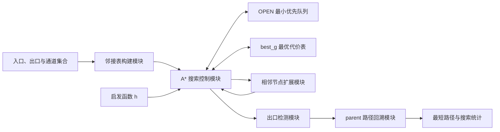

# 人工智能实验报告

## 实验二：迷宫问题

| 项目 | 内容 |
| --- | --- |
| 实验题目 | 使用 A* 算法求解 4 x 4 迷宫最短路径 |
| 学号 | 请填写 |
| 班级 | 请填写 |
| 姓名 | 请填写 |
| 完成日期 | 请填写 |

---

## 一、实验目的

1. 理解描述性的一般图搜索方法以及 A* 算法的基本原理。
2. 掌握迷宫的图结构表示方法，以及节点扩展、目标检测和路径回溯过程。
3. 使用 A* 算法求出从入口 `(1, 1)` 到出口 `(4, 4)` 的最短路径。
4. 绘制 A* 搜索流程图和算法框图，理解 `f(n)=g(n)+h(n)` 的作用。
5. 比较不同估价函数对搜索速度的影响，并总结启发式搜索的特点。

## 二、实验环境

| 项目   | 配置                                          |
| ---- | ------------------------------------------- |
| 操作系统 | Windows 10/11                               |
| 编程语言 | Python 3.10 及以上版本                           |
| 开发环境 | Anaconda3 5.0 及以上版本，或任意支持 Python 3 的 IDE/终端 |
| 标准库  | `heapq`、`dataclasses`、`itertools`、`time`    |
| 程序文件 | `maze_astar.py`                             |

运行命令：

```bash
python maze_astar.py
```

## 三、问题描述

在一个 `4 x 4` 迷宫中，每个可通行位置使用坐标 `(x, y)` 表示，其中 `x` 为行号，`y` 为列号，行列编号均从 1 开始。入口为 `(1, 1)`，出口为 `(4, 4)`。相邻且没有墙阻隔的两个位置之间可以移动，每次移动的代价为 1，要求使用 A* 算法寻找最短路径。

### 3.1 迷宫通道

程序把迷宫看作无向图。每个坐标是一个节点，两个坐标之间存在通道就用一条无向边连接。实验所用通道如下：

```text
(1,1)-(1,2)  (1,2)-(1,3)  (1,3)-(2,3)
(2,3)-(3,3)  (3,3)-(3,4)  (3,4)-(4,4)
(1,1)-(2,1)  (2,1)-(3,1)  (3,1)-(3,2)
(3,2)-(4,2)  (4,2)-(4,3)  (4,3)-(4,4)
(2,1)-(2,2)  (2,2)-(2,3)  (3,2)-(3,3)
```

图结构中只允许沿上述通道移动，这样可以避免穿过墙壁。

### 3.2 搜索问题的组成

- **初始节点**：入口 `(1, 1)`。
- **目标节点**：出口 `(4, 4)`。
- **可用操作**：沿迷宫通道移动到相邻节点。
- **单步代价**：每移动一格，代价为 1。
- **目标**：找到总代价最小的入口到出口路径。

## 四、基本原理

### 4.1 一般图搜索

一般图搜索维护两个重要集合：

- `OPEN`：已经发现、但尚未扩展的节点。
- 已访问记录：保存节点目前已知的最小路径代价，防止在图中反复搜索同一位置。

不同图搜索算法的主要区别在于如何从 `OPEN` 中选择下一个节点。广度优先搜索按进入顺序选择；一致代价搜索选择 `g(n)` 最小的节点；A* 则选择 `f(n)` 最小的节点。

### 4.2 A* 估价函数

A* 使用如下估价函数：

$$
f(n)=g(n)+h(n)
$$

- `g(n)`：从入口到当前节点 `n` 的实际路径长度。
- `h(n)`：从当前节点到出口的估计距离。
- `f(n)`：经过节点 `n` 到达出口的总代价估计。

题目给出的目标坐标为 `(X, Y)=(4,4)`，当前节点为 `(x,y)`。由于本实验坐标均不超过目标坐标，题目中的启发函数可以写成：

$$
h(n)=(X-x)+(Y-y)
$$

更一般的写法是曼哈顿距离：

$$
h(n)=|X-x|+|Y-y|
$$

本程序使用一般形式，因此即使搜索过程中坐标位于目标的其他方向，计算也仍然正确。

### 4.3 为什么曼哈顿距离可用

当前节点每移动一步，只能改变一个坐标 1 个单位。在不考虑墙壁时，到目标至少需要移动横向差与纵向差之和；墙壁只可能使真实路径更长。因此曼哈顿距离不会超过真实最短距离，是可采纳启发函数。使用它的标准 A* 算法能够找到最短路径。

## 五、解决问题的主要思路

1. 将 `4 x 4` 迷宫抽象成无向图，坐标为节点，通道为边。
2. 用邻接表保存每个节点能够直接到达的位置。
3. 用最小堆实现 `OPEN` 表，按照 `f(n)` 从小到大选择待扩展节点。
4. 用 `best_g` 保存入口到各节点目前已知的最小代价。
5. 扩展当前节点的所有相邻节点；若发现更短路径，则更新其代价和父节点。
6. 到达出口后，通过 `parent` 从出口反向回溯到入口，再将路径逆序。
7. 分别使用零启发、曼哈顿距离和加权曼哈顿距离进行实验，比较节点扩展情况。

## 六、A* 算法流程图

```mermaid
flowchart TD
    A([开始]) --> B[建立迷宫邻接表]
    B --> C[入口加入 OPEN 表]
    C --> D{OPEN 表为空?}
    D -- 是 --> E[报告不存在可行路径]
    E --> Z([结束])
    D -- 否 --> F[取出 f 值最小的节点 n]
    F --> G{n 是出口?}
    G -- 是 --> H[回溯并输出最短路径]
    H --> Z
    G -- 否 --> I[遍历 n 的相邻可通行节点 s]
    I --> J[计算 new_g = g(n) + 1]
    J --> K{new_g 更小?}
    K -- 是 --> L[更新 best_g 和 parent]
    L --> M[计算 h(s) 与 f(s)]
    M --> N[将 s 加入 OPEN 表]
    K -- 否 --> O[忽略该路径]
    N --> D
    O --> D
```

## 七、算法框图与伪代码



迷宫数据与搜索算法彼此分离：修改通道集合即可更换迷宫，而 A* 主体、启发函数和路径回溯逻辑不需要改变。

```text
A_STAR_MAZE(start, goal, h):
    OPEN <- 只含 start 的最小优先队列
    best_g[start] <- 0
    parent[start] <- 空

    当 OPEN 不为空时:
        n <- 取出 f(n) 最小的节点

        若 n 是 goal:
            从 goal 沿 parent 回溯到 start
            返回逆序后的路径

        对 n 的每个相邻可通行节点 s:
            new_g <- best_g[n] + 1
            若 s 从未访问，或 new_g < best_g[s]:
                best_g[s] <- new_g
                parent[s] <- n
                f(s) <- new_g + h(s)
                将 s 加入 OPEN

    返回“没有可行路径”
```

## 八、实验步骤

1. 确定入口、出口和所有可通行边，建立迷宫的图模型。
2. 编写 `build_graph()`，将无向边集合转换成邻接表。
3. 编写 `h_zero()`，用于模拟无启发信息的一致代价搜索。
4. 编写 `h_manhattan()`，按照横向距离与纵向距离之和估计剩余代价。
5. 编写 `h_weighted_manhattan()`，观察较大启发值对搜索过程的影响。
6. 编写 A* 主循环，用优先队列保存待扩展节点。
7. 编写路径回溯函数 `reconstruct()` 和文本路径显示函数 `draw_path()`。
8. 分别运行三种启发函数，记录路径长度、扩展节点数、生成节点数和 `OPEN` 表最大长度。
9. 检查路径中相邻节点之间是否均存在通道，并分析实验结果。

## 九、实验结果展示

### 9.1 最短路径

使用曼哈顿距离得到的路径为：

```text
(1,1) -> (1,2) -> (1,3) -> (2,3)
       -> (3,3) -> (3,4) -> (4,4)
```

共移动 6 步。路径示意如下：

```text
S * * .
. . * .
. . * *
. . . G
```

符号说明：

- `S`：入口 `(1,1)`。
- `G`：出口 `(4,4)`。
- `*`：最短路径经过的节点。
- `.`：不在本次最短路径上的节点。

从 `(1,1)` 到 `(4,4)` 的曼哈顿距离为 6。本实验找到的可行路径长度也是 6，因此它不可能再缩短，能够确认该路径是最短路径。

### 9.2 不同估价函数的结果

| 启发函数               | 路径长度 | 扩展节点数 | 生成节点数 | OPEN 最大长度 | 是否保证最优       |
| ------------------ | ---: | ----: | ----: | --------: | ------------ |
| `h(n)=0`           |    6 |    13 |    13 |         3 | 是            |
| `h(n)=曼哈顿距离`       |    6 |    13 |    13 |         3 | 是            |
| `h(n)=1.4 x 曼哈顿距离` |    6 |     7 |    10 |         4 | 一般不保证；本例仍为最优 |

运行时间通常小于 1 ms，会随机器负载波动，因此使用扩展节点数和生成节点数作为主要对比指标。

本迷宫规模较小，并且存在多条同长度路径。受优先队列中同优先级节点的处理顺序影响，标准曼哈顿距离在本例中的扩展数与零启发相同。这不表示曼哈顿距离无效，而是说明启发函数的实际效果还会受图结构和节点平局处理方式影响。

## 十、估价函数对搜索速度的影响

### 10.1 `h(n)=0`

此时 `f(n)=g(n)`，A* 退化为一致代价搜索。在每条边代价均为 1 的迷宫中，它与广度优先搜索的扩展顺序接近。算法保证最短路径，但不会主动朝出口方向搜索。

### 10.2 `h(n)=曼哈顿距离`

曼哈顿距离为搜索提供出口方向信息，且不会高估实际距离，因此能够兼顾搜索效率与最优性。通常在更大、岔路更多的迷宫中，它会比零启发扩展更少节点。

### 10.3 `h(n)=1.4 x 曼哈顿距离`

增大启发函数权重后，算法更偏向距离目标近的节点。本次实验只扩展 7 个节点，明显少于前两种方法。但是该启发函数可能高估真实剩余代价，因而理论上不能保证最短路径。本例结构简单，所以仍找到了长度为 6 的最短路径。

### 10.4 综合分析

估价函数对速度的影响不能只看数值大小：

1. 启发值太小，算法接近盲目搜索，通常扩展节点较多。
2. 启发值准确且不高估时，A* 能在保持最优性的同时减少搜索范围。
3. 启发值过大时，算法可能更快，但会降低或失去最优性保证。
4. 启发函数本身的计算也需要时间，复杂启发函数只有在减少的搜索量大于其计算开销时才值得使用。

## 十一、A* 启发式搜索的特点

1. **利用目标信息**：A* 同时考虑已经付出的代价和预计剩余代价，搜索方向比盲目搜索明确。
2. **完整性较好**：在分支有限、每步代价为正的条件下，只要存在路径，A* 能找到路径。
3. **可保证最优性**：使用可采纳且一致的启发函数时，A* 可以找到最短路径。
4. **性能依赖启发函数**：估计越接近真实剩余代价，搜索通常越集中。
5. **空间消耗可能较大**：算法需要保存待扩展节点、最小代价和父节点，在大型迷宫中可能占用大量内存。
6. **适用范围广**：A* 可用于迷宫、地图导航、机器人路径规划和游戏寻路等问题。
7. **需要正确处理重复节点**：迷宫是图而不是树，若不记录最优 `g` 值，算法可能在环路中重复搜索。

## 十二、实验结论

本实验将 `4 x 4` 迷宫转换为无向图，使用 A* 算法成功找到了从 `(1,1)` 到 `(4,4)` 的 6 步最短路径。实验验证了 `f(n)=g(n)+h(n)` 中启发函数对搜索方向的影响：零启发保证最优但缺少方向性；曼哈顿距离兼顾方向性和最优性；加权曼哈顿距离在本例中扩展节点最少，但一般不再保证最优解。因此，在实际应用中需要根据问题规模和对最优性的要求选择合适的启发函数。

## 附件：关键程序代码

### 曼哈顿距离

```python
def h_manhattan(point, goal=GOAL):
    return abs(goal[0] - point[0]) + abs(goal[1] - point[1])
```

### A* 搜索核心

```python
def astar(start=START, goal=GOAL, heuristic=h_manhattan):
    counter = itertools.count()
    open_heap = []
    best_g = {start: 0}
    parent = {start: None}

    h0 = heuristic(start, goal)
    heapq.heappush(open_heap, QueueNode(h0, next(counter), start, 0, h0))

    while open_heap:
        current = heapq.heappop(open_heap)
        if current.g != best_g[current.point]:
            continue

        if current.point == goal:
            return reconstruct(parent, goal)

        for neighbor in GRAPH[current.point]:
            new_g = current.g + 1
            if new_g >= best_g.get(neighbor, 10**9):
                continue

            best_g[neighbor] = new_g
            parent[neighbor] = current.point
            h = heuristic(neighbor, goal)
            heapq.heappush(
                open_heap,
                QueueNode(new_g + h, next(counter), neighbor, new_g, h),
            )
```

完整源程序见同目录下的 `maze_astar.py`。
