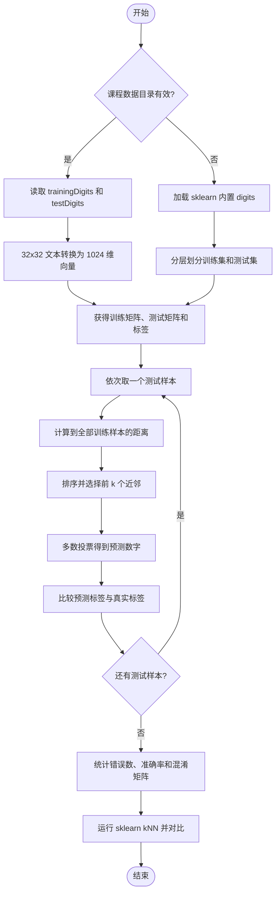
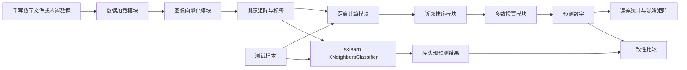

# 人工智能实验报告

## 实验五：基于 kNN 的手写数字识别

| 项目 | 内容 |
| --- | --- |
| 实验题目 | 基于 kNN 的手写数字识别 |
| 学号 | 请填写 |
| 班级 | 请填写 |
| 姓名 | 请填写 |
| 完成日期 | 请填写 |

---

## 一、实验内容

本实验使用 k 近邻算法完成手写数字识别。首先使用 Python 和 NumPy 从零实现 kNN 分类器，然后调用 scikit-learn 的 `KNeighborsClassifier` 完成同一任务，对比两种实现的预测结果、准确率和运行特点。

程序支持两种数据来源：

1. 附件要求的 `trainingDigits/testDigits` 目录，其中每个数字保存为一个 `32 x 32` 的二进制文本文件。
2. 当课程数据目录不存在时，自动使用 scikit-learn 内置的 `8 x 8` 手写数字数据集，保证实验在离线环境中仍可完整运行。

## 二、实验目的

1. 掌握 kNN 算法的数学原理和分类流程。
2. 理解手写数字图像如何转换为可计算的特征向量。
3. 使用 NumPy 独立实现 `classify0()` 函数。
4. 掌握训练数据加载、测试数据验证、错误数和错误率统计方法。
5. 学会使用 scikit-learn 的 kNN 分类接口。
6. 比较手写实现与库实现的结果，理解参数 $k$ 对分类的影响。

## 三、实验环境

| 项目 | 实际环境 |
| --- | --- |
| 操作系统 | Windows 10/11 |
| Python | 3.11.4 |
| NumPy | 2.4.6 |
| scikit-learn | 1.8.0 |
| 程序文件 | `handwriting_knn.py` |

附件给出的参考环境为 Python 3.6.5 和 scikit-learn 0.19.1。本程序使用当前版本 API 编写，同时保留附件要求的核心函数和数据格式兼容性。

运行离线实验：

```bash
python handwriting_knn.py
```

若已准备课程数据集：

```bash
python handwriting_knn.py --data-root "课程数据集目录" --k 3
```

指定目录下应包含：

```text
课程数据集目录/
├── trainingDigits/
│   ├── 0_0.txt
│   ├── 0_1.txt
│   └── ...
└── testDigits/
    ├── 0_0.txt
    ├── 0_1.txt
    └── ...
```

## 四、实验原理

### 4.1 kNN 分类原理

对于待分类样本 $x$，在训练集中找到与它距离最小的 $k$ 个样本，再将这些近邻中出现次数最多的类别作为预测类别：

$$
\hat{y}=\arg\max_c \sum_{x_i\in N_k(x)}I(y_i=c)
$$

其中 $N_k(x)$ 表示 $x$ 的 $k$ 个最近邻，$I(\cdot)$ 是指示函数。

### 4.2 欧氏距离

一幅手写数字图像展平后可看作高维向量。两个向量 $p$ 和 $q$ 的欧氏距离为：

$$
d(p,q)=\sqrt{\sum_{j=1}^{m}(p_j-q_j)^2}
$$

距离越小，说明两幅数字图像的像素分布越相似。程序排序时使用平方距离，因为平方根是单调函数，不会改变近邻次序；只在输出邻居信息时再开平方。

### 4.3 图像向量化

课程数据中的每个文本文件包含 32 行，每行 32 个 `0` 或 `1`。读取时按行展开：

$$
32\times32\longrightarrow1\times1024
$$

文件名格式为 `真实数字_编号.txt`，例如 `3_42.txt` 的标签为数字 3。

本机实际使用的离线数据集包含 `8 x 8` 灰度图，展开后每个样本有 64 个特征。两种数据只在图像尺寸和像素取值上不同，kNN 算法本身不变。

### 4.4 scikit-learn 实现

库实现使用：

```python
KNeighborsClassifier(
    n_neighbors=3,
    weights="uniform",
    metric="euclidean",
)
```

- `n_neighbors`：近邻数量 $k$。
- `weights="uniform"`：所有近邻票数权重相同。
- `metric="euclidean"`：使用欧氏距离。
- `algorithm="auto"`：由库自动选择搜索实现。

## 五、数据集说明

### 5.1 附件中的课程数据

附件说明 `trainingDigits` 约有 1935 个训练文件，`testDigits` 约有 946/947 个测试文件。文档两处测试数量表述不一致，且本次提供目录中没有这些文本文件，因此不能在本机重新测得附件截图中的错误数。

附件给出的参考结果为：

| 实现 | 参考测试数 | 参考错误数 | 正确换算的错误率 |
| --- | ---: | ---: | ---: |
| Python 手写 kNN | 946 | 11 | 1.1628% |
| scikit-learn kNN | 946 | 12 | 1.2685% |

附件中手写版本的“0.011628%”应是把小数错误率直接加上百分号；$11/946=0.011628$，换算为百分数应为 `1.1628%`。

### 5.2 本机离线验证数据

scikit-learn 的 `load_digits()` 共包含 1797 幅 `8 x 8` 手写数字图像。程序使用固定随机种子 42 进行分层划分：

| 数据部分 | 样本数 | 特征数 |
| --- | ---: | ---: |
| 训练集 | 1347 | 64 |
| 测试集 | 450 | 64 |

分层划分使数字 0～9 在训练集和测试集中的比例基本一致。

## 六、解决问题的主要思路

1. 检查是否指定了有效的课程数据目录。
2. 如果存在课程数据，逐个读取 `32 x 32` 文本并转换为 1024 维向量。
3. 如果课程数据缺失，加载 sklearn 内置 digits 数据并进行分层划分。
4. 对每个测试样本计算它到全部训练样本的欧氏距离。
5. 按距离升序选取前 $k=3$ 个近邻，进行多数投票。
6. 逐个测试样本累积错误数，计算准确率和混淆矩阵。
7. 用相同训练集、测试集和参数运行 sklearn 版本。
8. 比较两种实现的错误数、准确率和逐样本预测一致率。

## 七、算法流程图



## 八、算法框图



## 九、算法伪代码

```text
IMG_TO_VECTOR(file):
    检查文件是否恰好有 32 行
    检查每行是否恰好有 32 个 0/1 字符
    按行写入长度为 1024 的向量
    返回向量

CLASSIFY0(x, dataset, labels, k):
    检查输入维度、标签数量和 k 的范围
    distances <- dataset 中每个样本到 x 的欧氏距离
    nearest <- distances 从小到大排序后的前 k 个下标
    votes <- 统计 nearest 对应的类别
    若票数相同，选择邻居总距离更小的类别
    返回预测类别和近邻信息

TEST(train, test):
    error_count <- 0
    对每个测试样本:
        prediction <- CLASSIFY0(...)
        若 prediction 不等于真实标签:
            error_count <- error_count + 1
    accuracy <- 1 - error_count / 测试样本数
    返回统计结果
```

## 十、实验步骤

1. 编写 `img_to_vector()`，完成 `32 x 32` 文本到 1024 维向量的转换。
2. 从文件名提取真实数字标签，并检查标签是否在 0～9 范围内。
3. 编写目录加载函数，构造训练矩阵、测试矩阵及标签数组。
4. 编写 `classify0()`，实现距离计算、排序、选邻居和投票。
5. 编写手写版本批量评估函数，统计错误数和准确率。
6. 使用相同数据训练 `KNeighborsClassifier` 并预测测试集。
7. 计算两种实现的预测一致率和混淆矩阵。
8. 在缺少课程数据时使用内置 digits 数据完成离线验证。
9. 重复运行程序，确认固定随机种子下结果可复现。

## 十一、实验结果

### 11.1 实际运行结果

```text
基于 kNN 的手写数字识别实验
数据源: sklearn 内置 8x8 手写数字集（离线替代）
训练集: (1347, 64), 测试集: (450, 64), k=3
手写 kNN: errors=7, accuracy=98.4444%
sklearn kNN: errors=7, accuracy=98.4444%
两种实现预测一致率: 100.0000%
```

| 指标 | 手写 kNN | sklearn kNN |
| --- | ---: | ---: |
| 测试样本数 | 450 | 450 |
| 错误数 | 7 | 7 |
| 准确率 | 98.4444% | 98.4444% |
| 两种实现预测一致率 | 100.0000% | 100.0000% |

运行时间会受到 CPU、后台负载和库实现策略影响，因此不作为固定实验结论。两种实现得到完全相同的预测，说明手写算法的距离计算和投票逻辑正确。

### 11.2 混淆情况分析

7 个错误主要集中在以下数字之间：

| 真实数字 | 预测数字 | 数量 |
| ---: | ---: | ---: |
| 5 | 9 | 1 |
| 8 | 1 | 3 |
| 8 | 6 | 1 |
| 9 | 4 | 1 |
| 9 | 8 | 1 |

数字 8 与 1、6、9 的局部笔画可能相似；在 `8 x 8` 的低分辨率图像中，细节损失会进一步增加混淆。

## 十二、结果分析

### 12.1 k 值影响

$k$ 较小时，分类边界灵活，但更容易受噪声影响；$k$ 较大时，结果更平滑，但可能把较远样本加入投票。附件使用 $k=3$，本实验沿用该设置。实际任务应通过交叉验证选择 $k$。

### 12.2 手写实现与 sklearn 实现

手写版本便于理解算法内部过程，并可输出每个近邻的索引、距离和标签；sklearn 版本代码简洁，并可自动选择 brute、KD 树或球树等搜索策略。本次两者预测一致率为 100%，验证了手写实现的正确性。

### 12.3 图像表示的局限

直接展开图像会忽略像素之间的二维空间关系。图像轻微平移或旋转后，即使肉眼看起来仍是同一数字，向量距离也可能显著变化。这也是后续使用卷积神经网络的原因之一。

### 12.4 复杂度

对一个测试样本，暴力 kNN 需要与全部 $n$ 个训练样本计算 $m$ 维距离，时间复杂度约为 $O(nm)$，并需要保存训练集。训练过程很轻，但预测成本较高，因此 kNN 被称为懒惰学习算法。

## 十三、kNN 的优缺点

### 优点

- 原理简单，容易理解和实现。
- 不需要显式训练模型。
- 可处理多分类问题，分类精度通常较高。
- 对决策边界形状没有强假设。

### 缺点

- 预测时需要扫描大量训练样本，计算开销较大。
- 必须保存训练数据，空间复杂度较高。
- 对 $k$ 值、距离度量和特征缩放敏感。
- 样本类别不平衡时，多数类可能主导投票。
- 无法直接给出数据内部的可解释规则。

## 十四、实验结论

本实验完成了从 32×32 文本图像读取到 kNN 分类评估的完整程序，并提供课程数据缺失时的离线数据回退。使用内置 digits 数据验证时，手写 kNN 和 sklearn kNN 均在 450 个测试样本中仅错分 7 个，准确率为 98.4444%，预测一致率为 100%。实验说明 kNN 能够有效完成小规模手写数字识别，但其预测开销和对图像变形的敏感性限制了它在更复杂视觉任务中的应用。

## 附件：关键程序代码

```python
def img_to_vector(filename):
    lines = Path(filename).read_text(encoding="utf-8").splitlines()
    if len(lines) != 32:
        raise ValueError("Each digit file must contain exactly 32 lines.")

    vector = np.zeros(1024, dtype=np.float32)
    for row, line in enumerate(lines):
        pixels = line.strip()
        vector[row * 32:(row + 1) * 32] = [int(pixel) for pixel in pixels]
    return vector


def classify0(in_x, dataset, labels, k):
    differences = dataset - in_x
    squared_distances = np.einsum("ij,ij->i", differences, differences)
    nearest = np.argsort(squared_distances, kind="stable")[:k]
    distances = np.sqrt(squared_distances[nearest])
    neighbors = [
        (int(index), float(distance), int(labels[index]))
        for index, distance in zip(nearest, distances)
    ]
    votes = Counter(label for _, _, label in neighbors)
    distance_sums = {
        label: sum(distance for _, distance, item_label in neighbors
                   if item_label == label)
        for label in votes
    }
    prediction = min(
        votes,
        key=lambda label: (-votes[label], distance_sums[label], label),
    )
    return prediction, neighbors
```

完整源程序见同目录下的 `handwriting_knn.py`。

## 参考文献

1. Peter Harrington. *Machine Learning in Action*. Manning Publications, 2012.
2. 周志华. 《机器学习》. 清华大学出版社, 2016.
3. 李航. 《统计学习方法》. 清华大学出版社, 2012.
