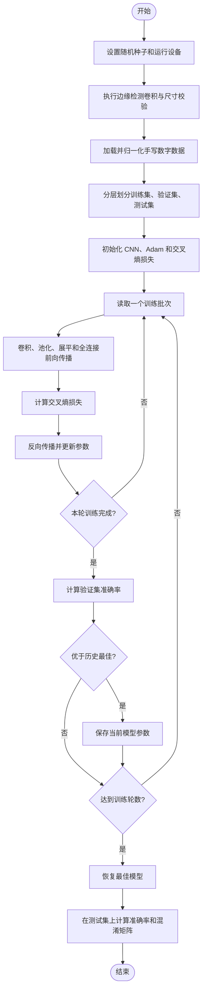

# 人工智能实验报告

## 实验六：卷积神经网络

| 项目 | 内容 |
| --- | --- |
| 实验题目 | 卷积神经网络原理及手写数字识别 |
| 学号 | 请填写 |
| 班级 | 请填写 |
| 姓名 | 请填写 |
| 完成日期 | 请填写 |

---

## 一、实验内容

本实验学习卷积神经网络（Convolutional Neural Network，CNN）的核心组成，包括卷积、边缘检测、padding、stride、激活函数、池化、全连接层和 softmax 分类。随后使用 PyTorch 构建一个小型 CNN，对手写数字 0～9 进行分类。

附件使用 Keras 和 MNIST。由于本机没有 Keras，且未缓存 MNIST、当前任务不能依赖网络下载，本实验采用现有 PyTorch 环境和 scikit-learn 内置的 `8 x 8` digits 数据集完成离线训练。模型结构和训练流程仍覆盖附件要求的全部 CNN 知识点。

## 二、实验目的

1. 掌握卷积神经网络的基本原理和典型结构。
2. 理解卷积核如何提取垂直边缘、水平边缘等局部特征。
3. 掌握 padding 和 stride 对输出尺寸的影响。
4. 理解最大池化、全连接层、dropout 和 softmax 的作用。
5. 使用深度学习框架构建并训练手写数字识别模型。
6. 根据验证准确率选择模型，并使用独立测试集评价泛化性能。

## 三、实验环境

| 项目 | 实际环境 |
| --- | --- |
| 操作系统 | Windows 10/11 |
| Python | 3.11.4 |
| PyTorch | 2.11.0 |
| NumPy | 2.4.6 |
| scikit-learn | 1.8.0 |
| 运行设备 | CPU |
| 程序文件 | `cnn_handwriting.py` |

运行命令：

```bash
python cnn_handwriting.py
```

可以调整训练参数：

```bash
python cnn_handwriting.py --epochs 15 --batch-size 64 --learning-rate 0.002 --device cpu
```

## 四、实验原理

### 4.1 为什么使用卷积神经网络

若把图像直接输入全连接网络，每个神经元都与上一层全部像素连接，参数量会随图像尺寸快速增长。CNN 通过两种机制降低参数量：

- **局部连接**：卷积核只观察图像的一个局部区域。
- **参数共享**：同一个卷积核在整幅图像上重复使用相同参数。

这样既减少参数，又保留了图像的二维空间结构。

### 4.2 二维卷积

对输入图像 $X$ 和卷积核 $K$，实验代码实现的二维互相关为：

$$
Y(i,j)=\sum_m\sum_n X(i+m,j+n)K(m,n)
$$

深度学习框架通常把这种不翻转卷积核的运算也称为卷积。卷积核在图像上滑动，每个位置执行逐元素相乘并求和。

### 4.3 边缘检测

实验使用垂直边缘检测核：

$$
K=\begin{bmatrix}
1&0&-1\\
1&0&-1\\
1&0&-1
\end{bmatrix}
$$

当卷积核跨过亮暗区域边界时，输出绝对值较大；位于颜色均匀区域时，输出接近 0。将卷积核转置可得到对应的水平边缘检测核。

### 4.4 padding

不填充称为 `valid`，输出尺寸通常缩小。`same` 模式通过在输入周围补零，使步长为 1 时输出尺寸保持不变。输入尺寸为 $n$，卷积核为 $f$，填充为 $p$，步长为 $s$ 时，输出尺寸为：

$$
n_{out}=\left\lfloor\frac{n+2p-f}{s}\right\rfloor+1
$$

当 $s=1$ 且希望 $n_{out}=n$ 时，奇数卷积核通常取：

$$
p=\frac{f-1}{2}
$$

### 4.5 stride

stride 表示卷积核每次移动的格数。步长越大，输出特征图越小、计算量越低，但可能丢失更多空间细节。例如 $n=7,f=3,p=0,s=2$：

$$
n_{out}=\left\lfloor\frac{7-3}{2}\right\rfloor+1=3
$$

### 4.6 卷积层与激活函数

一个卷积层包含多个可学习卷积核。若卷积核数量为 $C_{out}$，输出通道数也为 $C_{out}$：

$$
Z^{[l]}=W^{[l]}*A^{[l-1]}+b^{[l]}
$$

$$
A^{[l]}=g(Z^{[l]})
$$

本实验使用 ReLU：

$$
g(z)=\max(0,z)
$$

它引入非线性，并缓解深层网络中的梯度消失问题。

### 4.7 池化层

最大池化在局部窗口中保留最大值。本实验使用 `2 x 2` 窗口、步长 2，使特征图的高度和宽度减半。池化层没有需要学习的权重，可降低计算量并增强对小幅平移的鲁棒性。

平均池化则输出窗口平均值。图像分类中通常更常用最大池化。

### 4.8 全连接层、softmax 与损失函数

卷积特征图展平后进入全连接层，最后输出 10 个类别得分。softmax 将得分转换为概率：

$$
P(y=c\mid x)=\frac{e^{z_c}}{\sum_{j=0}^{9}e^{z_j}}
$$

训练使用多分类交叉熵：

$$
L=-\frac{1}{N}\sum_{i=1}^{N}\log P(y_i\mid x_i)
$$

PyTorch 的 `CrossEntropyLoss` 内部已经组合了 `log_softmax` 和负对数似然，因此模型最后一层直接输出 logits，不额外添加 softmax。

### 4.9 dropout 与批归一化

- `Dropout` 在训练时随机屏蔽部分神经元，减少共同适应，降低过拟合。
- `BatchNorm2d` 对小批量中的卷积特征进行标准化，使优化过程更稳定、收敛更快。

## 五、数据集与预处理

### 5.1 数据来源

附件使用 MNIST 的 28×28 灰度图。本机实际实验使用 scikit-learn 自带 digits，共 1797 幅 8×8 灰度图，类别为 0～9，像素范围为 0～16。该数据随库安装，无需网络下载。

### 5.2 预处理

1. 将像素除以 16，归一化到 `[0,1]`。
2. 添加通道维度，将形状从 `[N,8,8]` 变为 `[N,1,8,8]`。
3. 使用随机种子 42 进行分层划分。

| 数据部分 | 样本数 | 用途 |
| --- | ---: | --- |
| 训练集 | 1221 | 更新网络参数 |
| 验证集 | 216 | 选择最佳训练轮次 |
| 测试集 | 360 | 最终泛化性能评价 |

测试集只用于最终评价，没有参与参数更新和最佳轮次选择。

## 六、网络结构

| 层 | 参数 | 输出形状 | 作用 |
| --- | --- | --- | --- |
| 输入 | 灰度图 | `1 x 8 x 8` | 输入像素 |
| Conv1 | 16 个 `3 x 3` 核，padding=1 | `16 x 8 x 8` | 提取低级特征 |
| BatchNorm + ReLU | 16 通道 | `16 x 8 x 8` | 稳定训练并引入非线性 |
| MaxPool1 | `2 x 2`，stride=2 | `16 x 4 x 4` | 下采样 |
| Conv2 | 32 个 `3 x 3` 核，padding=1 | `32 x 4 x 4` | 提取组合特征 |
| BatchNorm + ReLU | 32 通道 | `32 x 4 x 4` | 稳定训练并引入非线性 |
| MaxPool2 | `2 x 2`，stride=2 | `32 x 2 x 2` | 下采样 |
| Flatten | - | `128` | 特征图转向量 |
| Dense | 128 单元，ReLU | `128` | 综合局部特征 |
| Dropout | 0.20 | `128` | 减少过拟合 |
| 输出层 | 10 单元 | `10` | 输出数字 0～9 的 logits |

模型共有 22,698 个可训练参数。

## 七、解决问题的主要思路

1. 用 NumPy 手工实现二维 valid 卷积，验证边缘检测过程。
2. 编写统一的卷积输出尺寸函数，验证 padding 和 stride 公式。
3. 加载手写数字图像并归一化，划分训练、验证和测试集。
4. 用两个“卷积 + 批归一化 + ReLU + 最大池化”模块提取特征。
5. 将特征图展平，经过全连接层和 dropout 得到 10 类输出。
6. 使用 Adam 优化器和交叉熵损失训练模型。
7. 每轮在验证集上计算准确率，将最佳验证模型保存在内存中。
8. 恢复最佳模型，在独立测试集上计算损失、准确率和混淆矩阵。

## 八、算法流程图



## 九、模型框图

```mermaid
flowchart LR
    A[1x8x8 输入图像] --> B[Conv 3x3, 16]
    B --> C[BatchNorm + ReLU]
    C --> D[MaxPool 2x2]
    D --> E[Conv 3x3, 32]
    E --> F[BatchNorm + ReLU]
    F --> G[MaxPool 2x2]
    G --> H[Flatten 128]
    H --> I[Dense 128 + ReLU]
    I --> J[Dropout 0.20]
    J --> K[Dense 10]
    K --> L[数字类别 0-9]
```



## 十、算法伪代码

```text
准备数据:
    images <- 像素除以 16 并添加通道维度
    train, validation, test <- 分层划分 images

初始化:
    model <- 两层卷积网络
    optimizer <- Adam(lr=0.002)
    loss <- CrossEntropyLoss

对 epoch = 1 到 15:
    进入训练模式
    对训练集中的每个 batch:
        logits <- model(images)
        batch_loss <- loss(logits, labels)
        梯度清零
        反向传播
        更新参数

    进入评估模式
    validation_accuracy <- 验证集准确率
    若准确率更高:
        保存当前模型参数

恢复最佳模型参数
在测试集上计算 loss、accuracy 和 confusion_matrix
```

## 十一、实验步骤

1. 编写 `convolution_output_size()`，实现卷积输出尺寸公式。
2. 编写 `conv2d_valid()`，手工完成二维卷积计算。
3. 构造 6×6 亮暗分区图像和 3×3 垂直边缘核，检查输出。
4. 加载 digits 数据，将像素归一化并增加通道维度。
5. 按 1221/216/360 划分训练、验证和测试数据。
6. 编写 `DigitCNN`，构建卷积层、池化层和全连接层。
7. 设置批大小 64、学习率 0.002、训练轮数 15 和 Adam 优化器。
8. 每轮记录训练损失与验证准确率，保留验证结果最好的模型。
9. 在测试集上计算最终指标，并分析混淆矩阵。

## 十二、实验结果

### 12.1 边缘检测与尺寸验证

6×6 图像经过 3×3 valid 卷积，输出尺寸为 4×4：

```text
[[ 0 -3 -3  0]
 [ 0 -3 -3  0]
 [ 0 -3 -3  0]
 [ 0 -3 -3  0]]
```

非零列准确对应图像中从暗区到亮区的垂直边界。符号正负由卷积核方向决定，绝对值表示边缘响应强度。

当 `n=7, f=3, p=0, s=2` 时，程序输出尺寸为 3，与公式计算一致。

### 12.2 训练参数

| 参数 | 数值 |
| --- | ---: |
| 随机种子 | 42 |
| epoch | 15 |
| batch size | 64 |
| 初始学习率 | 0.002 |
| 优化器 | Adam |
| 损失函数 | CrossEntropyLoss |
| 运行设备 | CPU |

### 12.3 训练与测试结果

关键训练记录：

| Epoch | 训练损失 | 验证准确率 |
| ---: | ---: | ---: |
| 1 | 1.7105 | 60.6481% |
| 2 | 0.5542 | 95.8333% |
| 4 | 0.1249 | 98.6111% |
| 8 | 0.0347 | 99.0741% |
| 14 | 0.0096 | **99.5370%** |
| 15 | 0.0067 | 99.0741% |

最终结果：

```text
最佳验证轮次: 14
最佳验证准确率: 99.5370%
测试损失: 0.0431
测试准确率: 98.8889%
```

360 个测试样本中正确识别 356 个，错误 4 个。四个错误都来自真实数字 8，其中 3 个被识别为 1，1 个被识别为 7；其余数字全部识别正确。

## 十三、结果分析

### 13.1 收敛情况

训练损失从 1.7105 降到 0.0067，说明网络已充分拟合训练数据。验证准确率在第 14 轮达到最高值，第 15 轮略有下降，因此程序恢复第 14 轮参数进行最终测试，避免直接使用最后一轮造成性能损失。

### 13.2 泛化能力

最佳验证准确率为 99.5370%，测试准确率为 98.8889%，二者相差约 0.65 个百分点，说明模型没有出现严重过拟合。批归一化提高了优化稳定性，dropout 对全连接层起到正则化作用。

### 13.3 错误样本

错误集中在数字 8，说明低分辨率图像中的上下两个闭环可能不完整，从而与细长的 1 或带横笔的 7 混淆。可通过数据增强、更高分辨率数据或增加训练样本改善。

### 13.4 与附件 MNIST 结果的关系

附件给出的 Keras/MNIST 参考正确率为 99.29%。本实验的 98.8889% 来自不同数据集、不同网络和不同划分，不能直接比较高低。二者都说明“卷积 + 池化 + 全连接”结构能够有效识别手写数字。

## 十四、CNN 的特点

### 优点

- 参数共享显著减少模型参数。
- 局部连接适合提取图像的空间结构。
- 多层卷积可逐级学习边缘、笔画和数字形状。
- 池化增强对小幅平移和局部变化的鲁棒性。
- 可端到端学习特征，不需要手工设计像素距离。

### 局限性

- 训练所需计算量通常高于传统机器学习算法。
- 需要选择卷积核数量、学习率、网络深度等超参数。
- 数据较少时容易过拟合，需要 dropout、数据增强等正则化方法。
- 模型内部特征不如简单规则直观，解释难度较高。

## 十五、实验结论

本实验完成了卷积、边缘检测、padding、stride、卷积层、池化层和全连接层的原理验证，并使用 PyTorch 构建了手写数字 CNN。模型在离线 digits 测试集上达到 98.8889% 准确率，验证了卷积神经网络通过局部连接和参数共享提取图像特征的有效性。与上一实验的 kNN 相比，CNN 能直接学习局部笔画结构，更适合扩展到尺寸更大、变化更复杂的图像识别任务。

## 附件：关键程序代码

```python
class DigitCNN(nn.Module):
    def __init__(self):
        super().__init__()
        self.features = nn.Sequential(
            nn.Conv2d(1, 16, kernel_size=3, padding=1),
            nn.BatchNorm2d(16),
            nn.ReLU(),
            nn.MaxPool2d(2),
            nn.Conv2d(16, 32, kernel_size=3, padding=1),
            nn.BatchNorm2d(32),
            nn.ReLU(),
            nn.MaxPool2d(2),
        )
        self.classifier = nn.Sequential(
            nn.Flatten(),
            nn.Linear(32 * 2 * 2, 128),
            nn.ReLU(),
            nn.Dropout(0.20),
            nn.Linear(128, 10),
        )

    def forward(self, inputs):
        return self.classifier(self.features(inputs))
```

完整源程序见同目录下的 `cnn_handwriting.py`。

## 参考文献

1. Ian Goodfellow, Yoshua Bengio, Aaron Courville. *Deep Learning*. MIT Press, 2016.
2. 郑泽宇, 梁博文, 顾思宇. 《TensorFlow：实战 Google 深度学习框架》. 电子工业出版社, 2018.
3. 周志华. 《机器学习》. 清华大学出版社, 2016.
