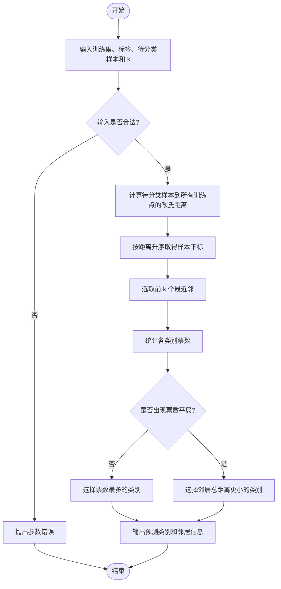
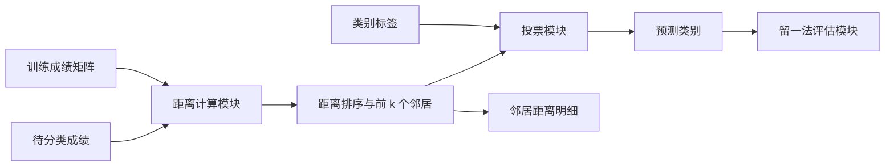

# 人工智能实验报告

## 实验四：kNN 算法

| 项目 | 内容 |
| --- | --- |
| 实验题目 | k 近邻算法原理及实现 |
| 学号 | 请填写 |
| 班级 | 请填写 |
| 姓名 | 请填写 |
| 完成日期 | 请填写 |

---

## 一、实验内容

本实验学习 k 近邻算法（k-Nearest Neighbor，kNN）的基本原理和分类流程，使用 NumPy 实现 kNN 核心函数，并根据 6 名已分类学生的理综、文综成绩，判断成绩为 `(105, 210)` 的学生属于“理科生”还是“文科生”。

## 二、实验目的

1. 掌握 kNN 分类算法的基本原理和执行流程。
2. 理解特征空间、距离度量、近邻选择和多数投票的含义。
3. 使用 Python 和 NumPy 独立实现 `classify0()` 函数。
4. 分析参数 $k$、距离度量和特征尺度对分类结果的影响。
5. 理解 kNN 的优点、缺点及适用场景。

## 三、实验环境与预备知识

| 项目   | 内容                               |
| ---- | -------------------------------- |
| 操作系统 | Windows 10/11                    |
| 编程语言 | Python 3.6.5 及以上版本               |
| 依赖库  | NumPy                            |
| 程序文件 | `kNN.py`                         |
| 预备知识 | 初等数学、Python 列表/字典/字符串、NumPy 数组操作 |

运行命令：

```bash
python kNN.py
```

## 四、实验原理

### 4.1 kNN 基本思想

kNN 的核心思想可以概括为“由邻居决定类别”。对于一个没有标签的新样本，算法在训练集中找到距离它最近的 $k$ 个样本，然后统计这些邻居的类别，将出现次数最多的类别作为预测结果。

kNN 既可用于分类，也可用于回归：

- 分类任务通常使用多数投票或距离加权投票。
- 回归任务通常使用邻居目标值的平均值或加权平均值。

### 4.2 欧氏距离

本实验使用欧氏距离。对两个 $m$ 维向量 $p$ 和 $q$：

$$
d(p,q)=\sqrt{\sum_{i=1}^{m}(p_i-q_i)^2}
$$

本实验只有理综成绩和文综成绩两个特征，因此：

$$
d=\sqrt{(science_p-science_q)^2+(arts_p-arts_q)^2}
$$

### 4.3 多数投票

设最近的 $k$ 个邻居组成集合 $N_k(x)$，预测类别为：

$$
\hat{y}=\arg\max_c \sum_{x_i\in N_k(x)} I(y_i=c)
$$

程序先比较各类别的票数。如果票数相同，则选择邻居总距离更小的类别；这样平局处理是确定的、可复现的。

### 4.4 k 值的影响

- $k$ 太小：模型对局部结构敏感，但容易受噪声和异常点影响。
- $k$ 太大：决策更平滑，但可能把距离较远、并不相似的样本加入投票，使多数类占优势。
- 实际应用中通常使用交叉验证选择 $k$，二分类常选择奇数以降低平票概率。

## 五、实验数据

| 编号 | 理综成绩 | 文综成绩 | 类别 |
| ---: | ---: | ---: | --- |
| 1 | 250 | 100 | 理科生 |
| 2 | 270 | 120 | 理科生 |
| 3 | 111 | 230 | 文科生 |
| 4 | 130 | 260 | 文科生 |
| 5 | 200 | 80 | 理科生 |
| 6 | 70 | 190 | 文科生 |

待分类样本为：

$$
x=(105,210),\quad k=3
$$

两个特征都是同一分制下的成绩，数值尺度接近，因此本实验可直接计算欧氏距离。若特征单位或范围差别很大，应先做标准化。

## 六、kNN 算法流程

1. 计算待分类样本与训练集中每个样本之间的距离。
2. 按照距离从小到大排序。
3. 选取距离最小的前 $k$ 个样本。
4. 统计这 $k$ 个邻居中各类别出现的次数。
5. 返回出现次数最多的类别作为预测结果。

## 七、解决问题的主要思路

1. 使用二维 NumPy 数组保存 6 个训练样本，每行表示一名学生。
2. 使用标签列表保存每个样本对应的“理科生”或“文科生”类别。
3. 利用 NumPy 广播计算待分类点与所有训练点的坐标差。
4. 使用向量范数一次性计算全部欧氏距离。
5. 通过 `argsort()` 得到按距离升序排列的原始下标。
6. 取前 3 个下标对应的标签进行多数投票。
7. 输出最近邻明细和最终类别，并用留一法比较不同 $k$ 值。

## 八、算法流程图



## 九、算法框图



## 十、算法伪代码

```text
KNN_CLASSIFY(inX, dataset, labels, k):
    检查数据维度、标签数量和 k 的范围
    distances <- dataset 中每个点到 inX 的欧氏距离
    indices <- 按 distances 从小到大排序后的下标
    neighbors <- indices 的前 k 项

    对每个 neighbor:
        对 neighbor 的类别计票

    prediction <- 票数最多的类别
    若票数相同:
        prediction <- 邻居总距离更小的类别
    返回 prediction 和 neighbors
```

## 十一、实验步骤

1. 编写 `create_dataset()`，录入 6 名学生的成绩和类别。
2. 编写 `classify0()`，接收待分类向量、训练集、标签和 $k$。
3. 使用 `np.linalg.norm()` 计算欧氏距离。
4. 使用稳定排序取得最近的 $k$ 个训练样本。
5. 使用 `Counter` 完成多数投票，并处理票数相同的情况。
6. 将 `(105,210)` 作为待分类样本，设置 $k=3$。
7. 输出三个最近邻的成绩、距离和类别，检查投票过程。
8. 编写 `leave_one_out_accuracy()`，分别评价 $k=1,3,5$。
9. 对照手工距离计算，验证程序输出。

## 十二、实验结果

### 12.1 三个最近邻

程序输出如下：

```text
kNN 学生成绩分类实验
待分类样本: 理综=105, 文综=210
k=3

最近邻（按距离升序）:
编号  理综  文综  距离      类别
   3   111   230   20.8806  文科生
   6    70   190   40.3113  文科生
   4   130   260   55.9017  文科生

预测类别: 文科生
```

距离最近的三个样本全部属于文科生，因此多数投票结果为“文科生”，与附件中的预期结果一致。

### 12.2 手工校验最近距离

待分类样本与编号 3 样本 `(111,230)` 的距离为：

$$
\sqrt{(111-105)^2+(230-210)^2}
=\sqrt{436}
\approx20.8806
$$

该结果与程序输出一致。

### 12.3 不同 k 值的留一法结果

| k 值 | 留一法准确率 | 分析 |
| ---: | ---: | --- |
| 1 | 100.00% | 最近的同类样本能够正确代表当前样本 |
| 3 | 100.00% | 局部多数投票稳定，分类结果正确 |
| 5 | 0.00% | 留出一个样本后，剩余五点中相反类别占多数，k 过大造成欠拟合 |

留一法每次取一个样本作为测试样本，其余样本作为训练集，能够在数据量很小时进行基本验证。该结果说明 $k$ 并非越大越好，应结合数据规模和分布选择。

## 十三、结果分析

### 13.1 k 值设定

本实验使用 $k=3$。它既能减弱单个异常点的影响，也不会把太多远距离样本加入投票。$k=5$ 在这个只有 6 条数据的小样本集上过大，导致局部结构被整体类别比例淹没。

### 13.2 类别判定方式

普通投票让每个邻居拥有相同权重，简单且符合附件要求。若训练数据噪声较多，可以使用距离加权投票，例如令权重为 $1/(d^2+\epsilon)$，使更近的邻居影响更大。

### 13.3 距离度量

欧氏距离适合连续数值特征，但会受到量纲影响。例如一个特征范围为 0～10000，另一个范围为 0～1，前者会支配距离结果。实际任务中通常先进行标准化：

$$
z=\frac{x-\mu}{\sigma}
$$

### 13.4 高维问题

随着特征维数增加，不同样本之间的距离会趋于相似，欧氏距离的区分能力下降，这就是“维数灾难”的一种表现。可以通过特征选择、降维或改进距离函数缓解。

## 十四、kNN 算法特点

### 优点

- 原理直观，代码实现简单。
- 几乎不需要显式训练，也不需要估计模型参数。
- 可以自然处理多分类问题。
- 决策边界灵活，适合类别区域交叉或形状不规则的数据。

### 缺点

- 属于懒惰学习，预测时必须扫描训练样本，计算量较大。
- 需要保存全部训练数据，内存开销较大。
- 对 $k$、距离度量、特征尺度和样本不平衡较敏感。
- 预测依据局部样本，难以给出像决策树那样清晰的全局规则。

### 性能改进方向

- 使用交叉验证选择合适的 $k$。
- 对数值特征进行标准化或归一化。
- 使用距离加权投票降低较远邻居的影响。
- 使用 KD 树、球树或近似最近邻方法提高大数据集查询速度。
- 删除冗余样本或选择代表性样本，降低存储与计算开销。

## 十五、实验结论

本实验使用 NumPy 实现了完整的 kNN 分类流程。对于待分类成绩 `(105,210)`，距离最近的三个训练样本均为文科生，因此预测结果为“文科生”。留一法实验进一步说明，小数据集上 $k=1$ 和 $k=3$ 能保持局部类别结构，而 $k=5$ 会因邻居范围过大导致欠拟合。实验验证了 kNN 的关键在于合理选择距离度量、$k$ 值和特征尺度。

## 附件：关键程序代码

```python
def classify0(in_x, dataset, labels, k):
    samples = np.asarray(dataset, dtype=float)
    query = np.asarray(in_x, dtype=float)

    distances = np.linalg.norm(samples - query, axis=1)
    nearest_indices = np.argsort(distances, kind="stable")[:k]
    neighbors = [
        (int(index), float(distances[index]), labels[index])
        for index in nearest_indices
    ]

    vote_counts = Counter(label for _, _, label in neighbors)
    distance_sums = {
        label: sum(distance for _, distance, item_label in neighbors
                   if item_label == label)
        for label in vote_counts
    }
    prediction = min(
        vote_counts,
        key=lambda label: (-vote_counts[label], distance_sums[label], label),
    )
    return prediction, neighbors
```

完整源程序见同目录下的 `kNN.py`。

## 参考文献

1. Peter Harrington. *Machine Learning in Action*. Manning Publications, 2012.
2. 周志华. 《机器学习》. 清华大学出版社, 2016.
3. 李航. 《统计学习方法》. 清华大学出版社, 2012.
