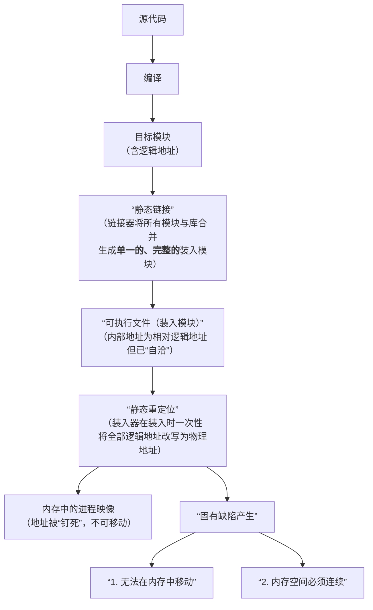
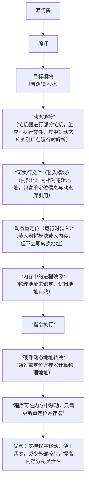

三种链接方式

- 静态链接
- 装入时动态链接
- 运行时动态链接
**多个进程在**物理内存中绝对共享同一份共享库的代码段 **，这是动态链接（包括装入时和运行时）最核心、最不可替代的优势

对比：
装入时动态链接与运行时动态链接
装入时：将所需库全量加入内存
运行时：按需，用到的时候加入内存


**详解链接操作**

- 何为链接？
	链接是将一个程序**相关的目标代码**结合在一起，生成一个可执行文件的过程。
	- 在汇编中有标号与标号的引用
	- 在高级语言中，有符号定义（变量，函数起始地址）与符号引用

源程序转换为可执行目标文件通常要经过 预处理，编译，汇编，（生成可重定位目标文件，地址为段内相对偏移）->链接->(可执行目标文件)->可执行文件中仍是逻辑地址-->经过静态重定位，动态重定位变为物理地址。


静态链接器将**多个**可重定向目标文件合成**一个**可执行目标文件，主要完成以下两个任务：
- 符号解析->解决多个文件中符号相互引用的问题
- 重定位

目标文件格式：
- Unix早期版本使用COFF
- 现代Unix使用ELF
- Window使用PE
节头表包含对文件中各节的说明信息，可重定位目标文件中一定要有节头表
- .bss节在文件中不占用空间，但是要分配内存
程序头表指示系统如何创建进程的存储器映像，可执行目标文件一定要有程序头表
- 创建存储器映像时，只读代码段与可读写数据段对应的页表项都被初始化为“未缓存页”，触发缺页异常时候才会真正加载到内存

---

## 静态链接流程开始

符号表:
在可重定向目标文件中，有符号表，包含了在程序模块中所有被定义的符号相关信息，对于C程序的模块m来说，有以下三种类型：
- 在模块m中定义并被其他模块引用的全局符号 （非静态全局变量，非静态函数名）
- 其他模块定义被m引用的外部符号
- 本地定义本地引用的本地符号（静态全局变量，静态函数名）
符号还分为强符号与弱符号

链接器要做的：
读取所有自带符号表 → 提取全局符号构建全局符号表 → 基于全局符号表完成解析、合并和重定位


符号解析:
- 定义三个集合
- E:目标文件集合
- U:未解析符号集合
- D:E中的文件中定义符号的集合

对于输入文件f , 链接器判断文件是目标文件还是库文件
- 如果是库文件，对于U中的未解析的符号，链接器用每一个库文件尝试解析U中的未解析符号
如果目标模块中定义了未解析符号x, 将m放入E中。并将x放入D中
- 如果是目标文件
根据文件中的符号具体的将其放入U或者D中
- 如果处理过程中向D中加入一个已经存在的符号，则链接器报错。

重定位：
重定位的在上述符号解析的基础上对E中的模块进行处理, 确定每个符号在虚拟地址空间的地址， 在**定义符号**的**引用处重定位**引用符号

- **定义符号重定位**，将相同的节合成一个新的节，例如将可重定向目标文件中的.data节合成一个新的大.data节
	然后链接器根据新节在虚拟地址中的起始位置以及新节中每个定义符号的位置，为新节中的每个定义符号确定存储地址。
- **引用符号重定位**，将引用符号指向定位符号起始处
	- 两种介绍的重定位方式：
	- R_386_PC32方式
		与PC有关
	- R_386_32方式
		是直接地址

## 静态链接在程序整个流程的位置




误区：
1. 静态链接与静态重定位是一回事（×）
如上面的流程所示，静态链接与静态重定位是两个不同的阶段，静态链接生成可执行文件->内部仍是逻辑地址->通过静态重定位变为物理地址
2. 静态链接不能使用动态重定位（×）
静态链接生成的可执行文件，可以使用动态重定位(查页表，实现虚实转换)方法，延迟绑定

加深理解：
1. 对比装入时动态链接与运行时动态链接
- 装入时动态链接在程序运行时候已经包含所有所需的模块了。而运行时动态链接正是整个时候才将所需模块载入。
- 装入时动态链接：在程序**加载阶段**一次性完成所有符号的地址绑定
- 运行时动态链接：在程序**运行阶段**，仅当符号**第一次被使用时**才进行地址绑定（延迟绑定 / Lazy Binding）


****
## 动态链接在程序整个流程的位置



加深理解：
- 使用动态重定位(查页表)使得程序可以在内存中移动
``` 
初始状态：
[OS][程序A][空闲][程序B]

内存紧凑后：
[OS][程序A][程序B][空闲]

操作系统只需将程序B的重定位寄存器值改为新起始地址，
程序B的所有逻辑地址将自动映射到新的物理地址。
对比静态重定位，写死了地址就不能移动了！

这里是先在内存里复制一份，然后再改映射，使用页表也是一样
```

## 加深理解：段式内存管理
- 便于共享
只要两个进程的段表指向同一块物理内存就能实现共享（或配置共享段表）
- 动态链接
分段结构天然利于动态链接
- 动态增长
申请的时候可以按需申请，运行时候可以增长（堆栈段）
- 方便编程

名词：共享段表
多个进程可以通过配置【共享段表】--->多个进程只存一份共享段表实现数据共享。

加深理解：
- 常说的虚拟地址空间=虚拟存储器（大小与内存/外存都无关，与虚拟地址有关）
- ==虚拟内存技术（请求分页/外存当作内存的后备）增加了内存的逻辑容量==
- 三种页框分配策略：
	可变大小，局部置换
	可变大小，全局置换
	固定大小，局部置换
	没有 固定大小，全局置换！


==对于虚拟地址空间的加深理解：==
![[Pasted image 20260813201401.png]]
![[Pasted image 20260813201416.png]]

## 内存映射文件：mmap
磁盘文件与虚拟地址空间之间建立直接的映射关系，是一种系统调用机制
1. 进程调用系统接口，请求内核在其虚拟地址空间中分配一块空闲区域
2. 内核建立该虚拟区域与磁盘文件指定偏移量、指定长度的映射关系
3. 此时**不会立即将文件内容加载到物理内存**
4. 当进程首次访问映射区域的某个虚拟地址时，==触发**缺页中断**==
5. 内核自动将对应的文件页从磁盘读入物理内存（内核区），并==更新页表==
6. 后续访问直接通过 MMU 转换为物理地址，与==普通内存访问无异==
7. 当进程修改映射区域内容时，内核会在适当的时候（如调用`msync()`或解除映射时）将脏页写回磁盘
8. 这个文件实际存储在物理页上，进程系统调用后会得到一个虚拟地址，进程使用虚拟地址访问
9. ![[Pasted image 20260813201823.png]]

==进一步对比read与mmap的拷贝方面的区别：==
![[Pasted image 20260813202358.png]]


对于内存映射文件与直接读取文件
![[Pasted image 20260813194328.png]]

## 对比共享内存与内存映射文件：

![[Pasted image 20260813194937.png]]

![[Pasted image 20260814213212.png]]


链接过程主要任务是要解决 多模块逻辑地址统一的问题
装入过程主要任务是要解决 虚拟地址到物理地址的转换的任务

在内存保护中，提到两种方式：
- 界地址寄存器（作用是 ==比== 看逻辑地址是否越界），重定位寄存器(作用是+，将逻辑地址转为物理地址)
- 在CPU中设置上下限 寄存器，存放用户进程在内存中的下限和上限地址，CPU每访问一个地址，硬件自动将地址与这两个地址比较，判断是否越界（==物理地址==）


区分
内部碎片与外部碎片，内部碎片，已分配给进程，进程未充分利用
外部碎片，散布在已分配分区之间，无法利用的小空闲块称为 外部碎片

动态分区算法分为顺序分配法和索引分配法
- 顺序分配法，依次遍历空闲分区链，查找第一个满足作业大小要求的分区
	- 首次适应法，空闲分区按照地址递增排列，找第一个满足请求的空闲分区
	- 邻接适应法，分配时从上次查找结束的位置继续循环搜索，而不是每次从头开始
	- 最佳适应法，分区按照容量==（递增）排列==**找到第一个满足的分区**,每次找到的都是满足任务的最小的分组，但是每次切分，逐渐积累，会导致外部碎片
	- 最坏适应法，==(递减排序)== **找第一个满足要求的分区，即每次找到的都是满足任务的最大的分区** 总是切割大的，系统很难满足大作业的需求
- 基于索引搜索的分配算法
	- 对空闲分区进行分类，每一类大小相同的空闲分区建立独立的空闲链表，并通过索引表统一管理，分配的时候，依据请求大小，定位对应的链表
		- 常见的索引分配算法
		- **快速适配法**，==预先==按照空间大小设置若干链表，根据实际对空间的需求，在索引表中找到能容纳其的最小类比的链表，然后取下一个空闲分区进行分配。缺点是 回收难，算法复杂
		- **伙伴系统**，$2^k$为大小建立空闲分区链，找能满足的，分割，然后将剩余的重新放回空闲分区链。回收的时候，若某空闲分区与其==伙伴分区（大小相同，地址相邻==）空闲，合并。
		- **哈希算法**，以分区大小为关键字，建立哈希函数，通过哈希函数计算出其在哈希表中的位置，从而快速获取相应空闲分区链
- 分页系统，有内部碎片，无外部碎片，因为一个页是基本单位！
- 页表中，页表项按页号顺序存放，因此页号作为索引是隐含的
- 系统中设置一个页表寄存器，当运行某个进程的时候从PCB中读取
- 对于一个页表来说，其长度是有限的，所以要判断是不是越界


解决页表项过多的问题，①采用多级页表，消除对连续内存的需求②仅将活跃的表项调入内存

虚拟内存的实现，必须建立在离散分配的内存管理方式基础上
为了实现请求分页机制需要有：
- 页表机制(提供更多的信息，判断某页是否在内存中(状态位)，访问字段(用于换页参考)，修改位(是否需要回写)，==外存地址(指示该页在外存中的存放位置，供掉页使用))==
- 缺页中断机制(在指令执行期间触发，重新执行引发缺页的指令)，在执行指令 copy A to B的时候，如果指令本身，A，B都跨越两个页，则最多触发6次缺页中断
- 地址变换机构

进程的页框分配
- 进程的最小页框数是指能保证进程正常运行所需的最少页框数量，与硬件有关，取决于指令的格式，功能，寻址方式，
有关于最小页框的详解：==其考虑的是最坏情况下所需跨的页面数==
### 最小页框数（最小物理块数）详解

这个概念来自操作系统的**请求分页存储管理**。核心问题是：**一个进程至少需要多少物理内存页框，才能保证它能正常地跑起来？**

#### 一、概念本身

- **页框（frame）**：物理内存被划分成一个个固定大小的块，每个块叫页框。
- **页（page）**：进程的逻辑地址空间被划分成同样大小的块，每个块叫页。
- **最小页框数**：保证进程**能正常执行**（不因缺页而根本无法运行）所需的**最少**物理页框数量。

如果操作系统分配给进程的页框数低于这个值，进程会**根本无法运行**——不是"跑得慢"，而是跑不动，因为一条指令还没执行完就可能频繁缺页、甚至出现"取不到指令或数据"的死局。

#### 二、为什么这个值和"硬件结构"有关

最小页框数不是固定的，它取决于**指令集和寻址方式**。关键逻辑是：**一条指令执行过程中，同时需要驻留在内存里的页面数量，决定了最小页框数。**

分几种情况来看：

| 机器类型 | 寻址方式 | 最小页框数 | 原因 |
|---------|---------|-----------|------|
| 简单机器 | 单地址指令 + 直接寻址 | **2** | 1 个放指令，1 个放数据 |
| 稍复杂机器 | 支持间接寻址 | **3** | 指令、指针、数据各 1 个 |
| 功能较强的机器 | 指令/操作数可能跨页 | **6** | 指令 + 两个操作数，各自可能跨 2 个页 |

#### 三、逐条解释

### 1. 单地址 + 直接寻址 → 2 个页框

一条单地址指令，操作数地址直接写在指令里（直接寻址）。执行时需要同时访问两样东西：

1. **指令本身**所在的那一页
2. 数据（操作数）所在的那一页

所以至少需要 **2 个页框**：一个装指令页，一个装数据页。如果只给 1 个页框，取完指令后还要取数据，但数据页会把这个唯一页框占掉，指令页被换出……来回抖动，根本无法完成执行。

### 2. 支持间接寻址 → 3 个页框

间接寻址是指令里给的是一个**指针地址**，要先根据指针去内存里**取到真正的操作数地址**，再按这个地址取数据。于是执行时要同时访问三样东西：

1. **指令**
2. **指针（存操作数地址的单元）**
3. **数据（操作数本身）**

三者可能各在不同页上，所以至少需要 **3 个页框**。

### 3. 功能较强的机器 → 6 个页框

这是一段常被单独拿出来考的文字。要点是：**一条指令本身可能跨越 2 个页，两个操作数也可能各自跨越 2 个页。**

假设一条指令需要访问两个操作数（比如 `ADD A, B`）。在最坏情况下：

- 指令：横跨页面边界，占用 **2 页**
- 操作数 A：横跨页面边界，占用 **2 页**
- 操作数 B：横跨页面边界，占用 **2 页**

$$2 + 2 + 2 = 6$$

所以最坏情况下这条指令会**同时涉及 6 个不同的页面**。为了保证这 6 个页面能**同时驻留在内存**、指令顺利完成，就必须给进程分配**至少 6 个页框**。

#### 四、一个容易混淆的点

> ==最小页框数 = 一条指令执行时**同时**需要的最多页面数==

这里的核心是"**同时**"两个字。不是说进程总共只有 6 个页，而是说在执行某一条指令的瞬间，内存里**必须同时**有这 6 个页，缺一不可。一旦少一个，就会在指令执行中途缺页，导致该指令无法一次完成。

#### 五、总结
- 最小页框数 = **能保证进程正常运行的最少物理内存页框数**。
- 它**取决于硬件/指令集**，不是操作系统随便定的。
- 判断方法：**找出一条指令执行时"同时需要驻留内存"的最多页面数**，那就是最小页框数。
- 常见结论：直接寻址 → 2，间接寻址 → 3，指令+双操作数各自跨页 → 6。

==内存分配策略==，对于一个进程而言其页面数量，按照可不可变分为：固定和可变分配策略
在进行置换的时候，按照置换范围，可以分为局部置换，全局置换

组合处三种方式：
局部置换，固定分配
全局置换，可变分配
局部置换，可变分配(思考，局部置换是如何实现可变分配的？操作系统根据缺页率动态调整其驻留集的大小)

调入页面的时机
- 采用预调页方式，根据局部性原理，系统尝试预测进程近期可能访问的页面并预先调入
- 请求调页，每次只调一页，导致IO开销大

从何处调页
- 请求分页系统中的外存分为两部分，存放文件的文件区，存放换出页面的对换区。
- 对换区采用顺序分配，文件区采用离散分配
- 对换区是文件区的复制，也可存放运行时的堆栈段等

根据是否修改
- 对于可能修改的文件，==在从内存换出的时候，需要存放到对换区；调入的时候从对换区调入==
- 对于没有修改的文件，无需写回磁盘
根据是否运行过（Unix方式）
- 与进程有关的文件时钟保留在文件区
- 未运行过的页面从文件区调入，曾经运行过但是已被换出的页面存放在对换区，后续调入的时候从对换区调入

替换算法：
- 最佳算法(理论意义)，每次替换==未来最长时间不会被访问的页面==
- FIFO 算法，Belady异常，当为进程分配的物理块数增加时，缺页次数反而上升
- LRU 淘汰最近==最长时间未使用==的页面
- Clock算法，简单clock算法，将页框组织成一个循环队列，若访问位为0，则直接淘汰；如果访问位为1，则将其置为0，指针顺延到下一个页面
- 改进Clock算法，在访问位的基础上增加修改位，先找没访问过的替换，如果全都访问过，则全部清零，然后再找没访问过的，在找没访问过的这个过程中，==优先找没访问过也没修改过==的！  意思是，==访问位是第一优先级==，访问位为0的优先被淘汰，同为访问位为0的页，修改位发挥作用，先替换修改位为0的

抖动:
- 刚刚换入的页又要换出，刚刚换出的页又要调入，这种  频繁的页面调度 现象叫做 ==抖动==
- 根本原因在于，分配给进程的物理块数量过少
工作集：
- 用于指导页框的分配
- 指的是 某段时间内，进程实际访问过的页面的集合
- 工作集反映了进程在随后一段时间内，很可能频繁访问的页面集合
- 驻留集不应小于工作集


页面缓冲算法：
- ==保存已修改且需要被换出的页面==，等被换出的页面数量==达到一定值时候==，再批量写回磁盘
- 系统在内存中维护两个专用链表，
- **空闲页面链表**，==未修改的页面换出==的时候，直接挂在空闲链表上末尾，页框中仍保留着原有数据，若后续有进程访问相同页面，可直接从空闲链表中取下该页框复用，从而避免从磁盘重新读入，减少页面换入开销
- **修改页面链表**，当进程需要将一个已修改的页面换出的时候，系统不会立即写回磁盘，而是将其所在的页框挂在链表末尾，等链表中积累这足够数量的脏页之后，再批量写回磁盘
- 页面缓冲算法优点： ①显著降低页面换入换出的频率，大幅减少磁盘IO开销 ②性能良好，无需特殊硬件支持，简单高效


- **页框回收**，当系统内存不足的时候，必须回收部分页框，但并非所有页框都可回收，属于内核的大部分页框不可回收，而进程使用的页框可回收;在Linux内核中设置了用于负责页面换出的守护进程，kswapd ，当空闲页框低于特定阈值的时候，主动发起页框回收操作，
- Linux通过伙伴算法的逆操作实现页框回收，当一个页框被释放的时候，系统检查是否存在==大小相等==的伙伴空闲块，若存在，则将两者合并为一个大小翻倍的新空闲块，然后继续向上检查该新块能否与更高一级的伙伴再次合并，直到无法合并

页表在虚拟地址空间中是在内核区的！
- 请求分页这一机制，使得内存的利用率更高，有些页程序声明了，未必使用得到，所以等使用到的时候再加载 间接扩充了内存！
- 驻留集，进程已装入内存的页面的合集
- 工作集，某段时间，==进程运行所需要访问的页面的==集合

- 虚拟存储技术与 请求分页/段 的关系是： **目标与具体实现的关系**
![[Pasted image 20260824094812.png]]
![[Pasted image 20260824094827.png]]

- 对比对内存的==连续分配==与==离散分配==
  核心区别在于进程的逻辑地址空间==是否必须占用连续的物理空间==
- 离散分配（分页/分段）是实现虚拟存储的基础——只有进程被拆成独立单元才能做到"按需调入、部分驻留、换入换出"；
- 连续分配本质上要求整体装入，很难支持虚拟存储。


逻辑要清晰：

| 连续分配     |                    |        |
| -------- | ------------------ | ------ |
| 固定(大小)分区 | 动态(大小)分区（需要重定位寄存器） | 单一连续分配 |
|          |                    |        |
| **离散分配** |                    |        |
| 请求分页     | 请求分段               | 段页     |

- 交换区满了会发生什么？
![[Pasted image 20260824101453.png]]


- 页缓冲队列指的是什么？，是否影响缺页率?（不影响）
指的是页面缓冲算法中维护的空闲页队列和修改页队列
![[Pasted image 20260824110724.png]]


- 磁盘块到页的映射是如何实现的？
页表里需要记录对应磁盘块的位置。请求分页系统的页表项中有一个专门的字段——**"外存地址"**（外存块号/磁盘块号），用来记录"某一页在外存（磁盘）上存放在哪里"。缺页时，系统正是靠这个字段才能知道该去哪块磁盘把页读回来。
![[Pasted image 20260824110159.png]]


- linux中的伙伴系统，与分页存储的配合：
  Linux 既用分页存储，也用伙伴系统，二者不是二选一。
   - 分页是虚拟内存机制，管"地址映射"；
   - 伙伴系统是物理页框分配器，管"内存从哪来"。  
   伙伴系统在 Linux 中主要负责分配物理页框：缺页时为进程页分配页框、为内核分配页表/数据结构、作为 slab 的底层、以及满足 DMA
   等物理连续内存需求。缺页中断发生时，就是"分页系统"向"伙伴系统"要一个空闲页框，再把虚拟页映射过去。


