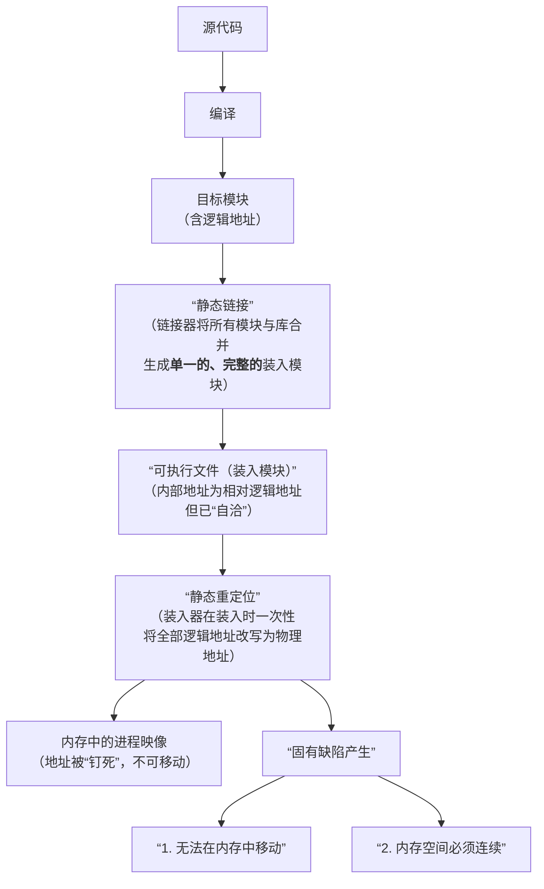
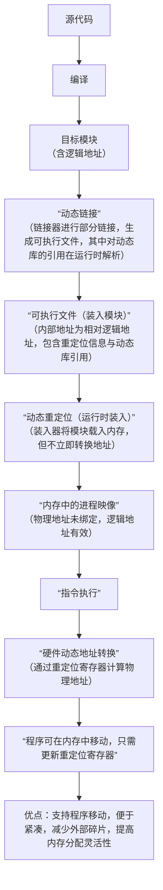

三种链接方式

- 静态链接

- 装入时动态链接
- 运行时动态链接
**多个进程在**物理内存中绝对共享同一份共享库的代码段 **，这是动态链接（包括装入时和运行时）最核心、最不可替代的优势

对比：
装入时动态链接与运行时动态链接
装入时：将所需库全量加入内存
运行时：按需，用到的时候加入内存


**详解链接操作**

- 何为链接？
	链接是将一个程序**相关的目标代码**结合在一起，生成一个可执行文件的过程。
	- 在汇编中有标号与标号的引用
	- 在高级语言中，有符号定义（变量，函数起始地址）与符号引用

源程序转换为可执行目标文件通常要经过 预处理，编译，汇编，（生成可重定位目标文件，地址为段内相对偏移）->链接->(可执行目标文件)->可执行文件中仍是逻辑地址-->经过静态重定位，动态重定位变为物理地址。


静态链接器将**多个**可重定向目标文件合成**一个**可执行目标文件，主要完成以下两个任务：
- 符号解析->解决多个文件中符号相互引用的问题
- 重定位

目标文件格式：
- Unix早期版本使用COFF
- 现代Unix使用ELF
- Window使用PE
节头表包含对文件中各节的说明信息，可重定位目标文件中一定要有节头表
- .bss节在文件中不占用空间，但是要分配内存
程序头表指示系统如何创建进程的存储器映像，可执行目标文件一定要有程序头表
- 创建存储器映像时，只读代码段与可读写数据段对应的页表项都被初始化为“未缓存页”，触发缺页异常时候才会真正加载到内存

---

## 静态链接流程开始

符号表:
在可重定向目标文件中，有符号表，包含了在程序模块中所有被定义的符号相关信息，对于C程序的模块m来说，有以下三种类型：
- 在模块m中定义并被其他模块引用的全局符号 （非静态全局变量，非静态函数名）
- 其他模块定义被m引用的外部符号
- 本地定义本地引用的本地符号（静态全局变量，静态函数名）
符号还分为强符号与弱符号

链接器要做的：
读取所有自带符号表 → 提取全局符号构建全局符号表 → 基于全局符号表完成解析、合并和重定位


符号解析:
- 定义三个集合
- E:目标文件集合
- U:未解析符号集合
- D:E中的文件中定义符号的集合

对于输入文件f , 链接器判断文件是目标文件还是库文件
- 如果是库文件，对于U中的未解析的符号，链接器用每一个库文件尝试解析U中的未解析符号
如果目标模块中定义了未解析符号x, 将m放入E中。并将x放入D中
- 如果是目标文件
根据文件中的符号具体的将其放入U或者D中
- 如果处理过程中向D中加入一个已经存在的符号，则链接器报错。

重定位：
重定位的在上述符号解析的基础上对E中的模块进行处理, 确定每个符号在虚拟地址空间的地址， 在**定义符号**的**引用处重定位**引用符号

- **定义符号重定位**，将相同的节合成一个新的节，例如将可重定向目标文件中的.data节合成一个新的大.data节
	然后链接器根据新节在虚拟地址中的起始位置以及新节中每个定义符号的位置，为新节中的每个定义符号确定存储地址。
- **引用符号重定位**，将引用符号指向定位符号起始处
	- 两种介绍的重定位方式：
	- R_386_PC32方式
		与PC有关
	- R_386_32方式
		是直接地址


## 静态链接在程序整个流程的位置




误区：
1. 静态链接与静态重定位是一回事（×）
如上面的流程所示，静态链接与静态重定位是两个不同的阶段，静态链接生成可执行文件->内部仍是逻辑地址->通过静态重定位变为物理地址
2. 静态链接不能使用动态重定位（×）
静态链接生成的可执行文件，可以使用动态重定位方法，延迟绑定

加深理解：
1. 对比装入时动态链接与运行时动态链接
- 装入时动态链接在程序运行时候已经包含所有所需的模块了。而运行时动态链接正是整个时候才将所需模块载入。
- 装入时动态链接：在程序**加载阶段**一次性完成所有符号的地址绑定
- 运行时动态链接：在程序**运行阶段**，仅当符号**第一次被使用时**才进行地址绑定（延迟绑定 / Lazy Binding）


****
## 动态链接在程序整个流程的位置



加深理解：
- 使用动态重定位使得程序可以在内存中移动
``` 
初始状态：
[OS][程序A][空闲][程序B]

内存紧凑后：
[OS][程序A][程序B][空闲]

操作系统只需将程序B的重定位寄存器值改为新起始地址，
程序B的所有逻辑地址将自动映射到新的物理地址。
对比静态重定位，写死了地址就不能移动了！
```

## 加深理解：段式内存管理
- 便于共享
只要两个进程的段表指向同一块物理内存就能实现共享
- 动态链接
分段结构天然利于动态链接
- 动态增长
申请的时候可以按需申请，运行时候可以增长（堆栈段）
- 方便编程

名词：共享段表
多个进程可以通过配置【共享段表】--->多个进程只存一份共享段表实现数据共享。


加深理解：
- 常说的虚拟地址空间=虚拟存储器（大小与内存/外存都无关）
- 虚拟内存技术（请求分页/外存当作内存的后备）增加了内存的逻辑容量

- 三种页框分配策略：
	可变大小，局部置换
	可变大小，全局置换
	固定大小，局部置换
	没有 固定大小，全局置换！
	

## 内存映射文件：
磁盘文件与虚拟地址空间之间建立直接的映射关系，是一种系统调用机制
1. 进程调用系统接口，请求内核在其虚拟地址空间中分配一块空闲区域
2. 内核建立该虚拟区域与磁盘文件指定偏移量、指定长度的映射关系
3. 此时**不会立即将文件内容加载到物理内存**
4. 当进程首次访问映射区域的某个虚拟地址时，触发**缺页中断**
5. 内核自动将对应的文件页从磁盘读入物理内存，并更新页表
6. 后续访问直接通过 MMU 转换为物理地址，与普通内存访问无异
7. 当进程修改映射区域内容时，内核会在适当的时候（如调用`msync()`或解除映射时）将脏页写回磁盘


## 对比共享内存与内存映射文件：
这是最容易混淆的概念，实际上**POSIX 共享内存就是基于内存映射文件实现的**，但它们有一个关键区别：**存储位置不同**。

- **内存映射文件**：数据最终存储在**磁盘文件**中，物理内存只是缓存
- **POSIX 共享内存**：数据存储在**tmpfs 文件系统**中（位于内存），不会写入磁盘
- **System V 共享内存**：数据存储在**内核专用内存区域**中，与文件系统无关

